# Data Studio 2024 Personal Projects Test Page

Quick checks to make sure our pages are looking their best.

<table><tr><td><a href="#charlenelin0824githubio">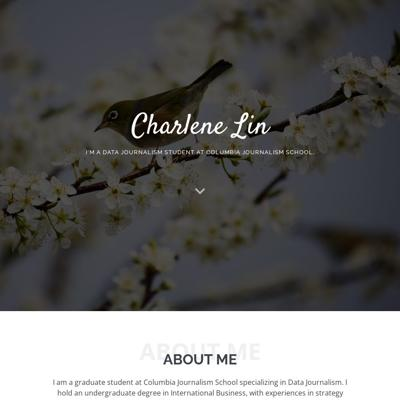 charlenelin0824.github.io</a></td>
<td><a href="#dlaiugithubio">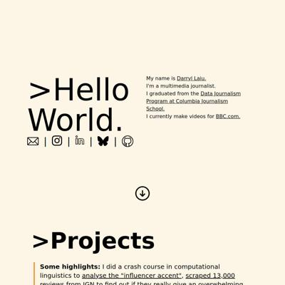 dlaiu.github.io</a></td>
<td>github.com request failed</td>
<td><a href="#juliezhngithubio">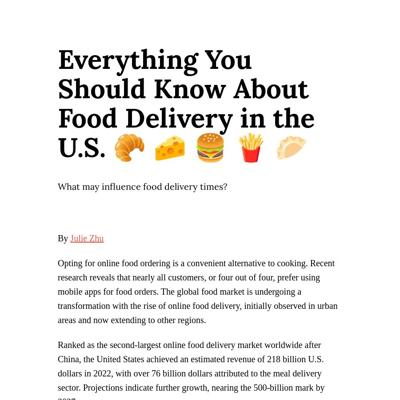 juliezhn.github.io</a></td>
</tr><tr>
<td><a href="#katrventuragithubio">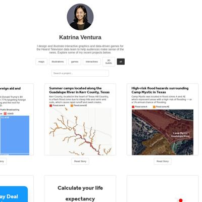 katrventura.github.io</a></td>
<td><a href="#lauramiinagithubio"> lauramiina.github.io</a></td>
<td><a href="#mandiuugithubio">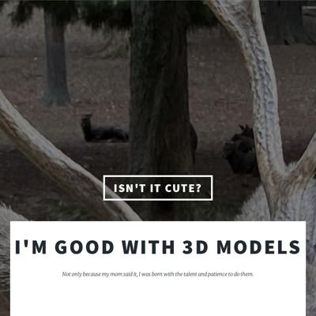 mandiuu.github.io</a></td>
<td><a href="#meghnadbosegithubio">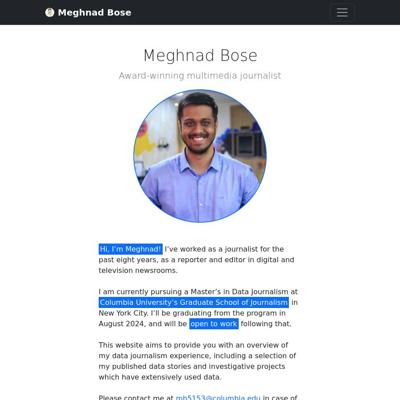 meghnadbose.github.io</a></td>
</tr><tr>
<td><a href="#mjdanburygithubio">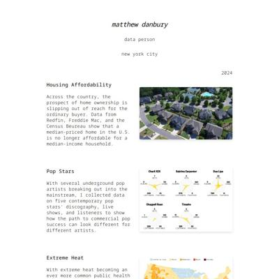 mjdanbury.github.io</a></td>
<td><a href="#ml4998githubio">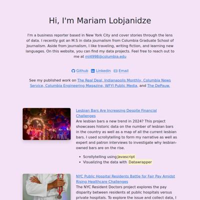 ml4998.github.io</a></td>
<td><a href="#pettravelstreamlitapp">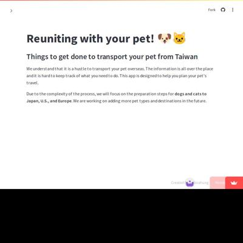 pettravel.streamlit.app</a></td>
<td><a href="#radhika3558githubio">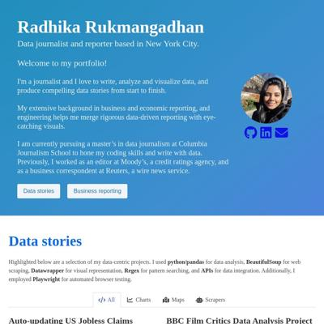 radhika3558.github.io</a></td>
</tr><tr>
<td><a href="#renatadaougithubio">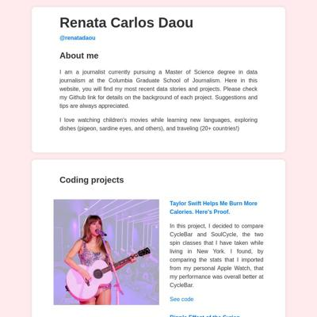 renatadaou.github.io</a></td>
<td><a href="#sabinahunggithubio">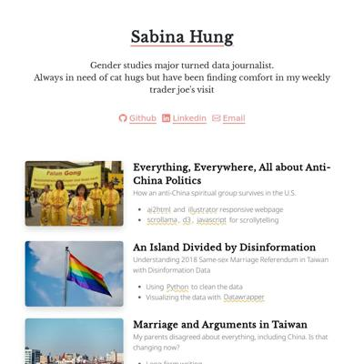 sabinahung.github.io</a></td>
<td><a href="#shivangibishnoigithubio">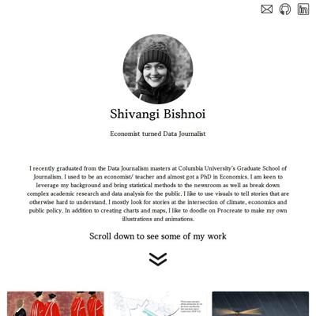 shivangibishnoi.github.io</a></td>
<td><a href="#thomastaoligithubio"> thomastaoli.github.io</a></td>
</tr><tr>
<td><a href="#yc4330githubio">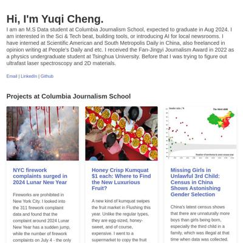 yc4330.github.io</a></td>
</tr></table>

## charlenelin0824.github.io

|url|mobile|medium|wide|
|---|---|---|---|
|[Charlene Lin  Columbia Journalism School  Portfolio](https://charlenelin0824.github.io/) :x: og:title :x: og:description :x: og:image [how to fix](https://jonathansoma.com/everything/web/social-tags/)|[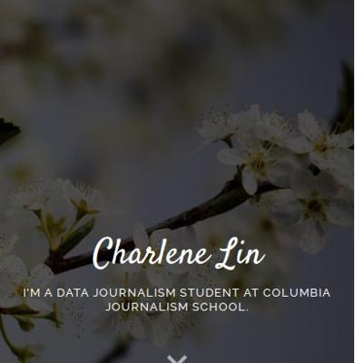](screenshots/charlenelin0824.github.io/index.html-mobile-full.jpg)||[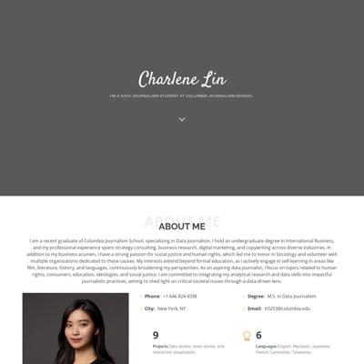](screenshots/charlenelin0824.github.io/index.html-wide-full.jpg)|
|[BBC Film Project](https://charlenelin0824.github.io/BBC-film-project/) :x: og:title :x: og:description :x: og:image [how to fix](https://jonathansoma.com/everything/web/social-tags/)|[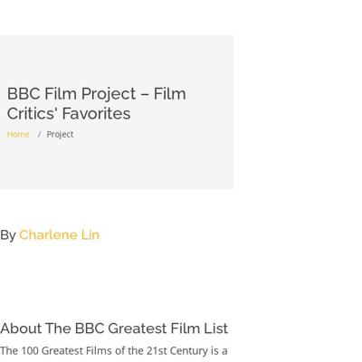](screenshots/charlenelin0824.github.io/BBC-film-project_index.html-mobile-full.jpg)||[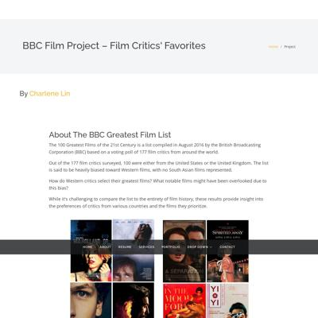](screenshots/charlenelin0824.github.io/BBC-film-project_index.html-wide-full.jpg)|
|[Deadly Sweet – Sugar in American Diet Compared Internationally](https://charlenelin0824.github.io/deadly-sweet/) :x: og:title :x: og:description :x: og:image [how to fix](https://jonathansoma.com/everything/web/social-tags/)|[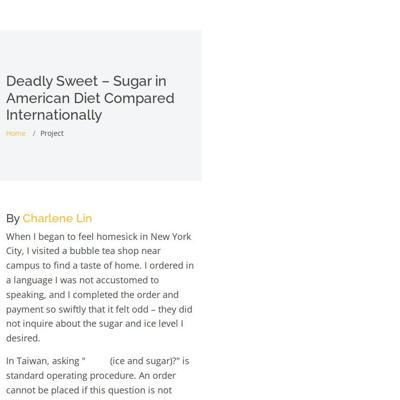](screenshots/charlenelin0824.github.io/deadly-sweet_index.html-mobile-full.jpg)|[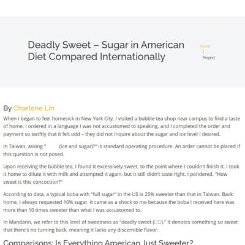](screenshots/charlenelin0824.github.io/deadly-sweet_index.html-medium-full.jpg)|[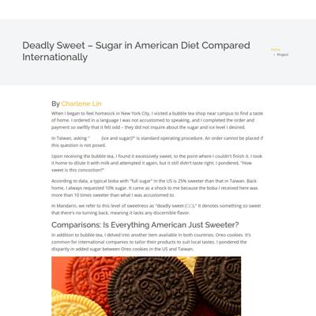](screenshots/charlenelin0824.github.io/deadly-sweet_index.html-wide-full.jpg)|
|[Feast for the Senses: Taiwan's Thriving Buffet Restaurant Scene](https://charlenelin0824.github.io/fancy-buffet/) :x: og:title :x: og:description :x: og:image [how to fix](https://jonathansoma.com/everything/web/social-tags/)|[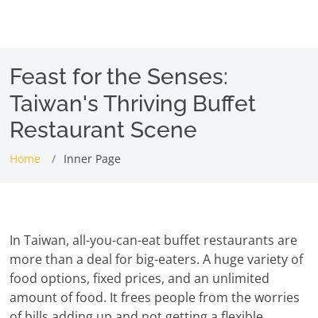](screenshots/charlenelin0824.github.io/fancy-buffet_index.html-mobile-full.jpg)|[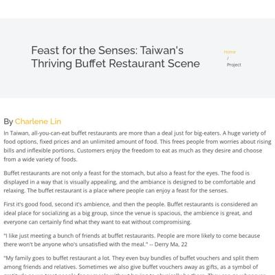](screenshots/charlenelin0824.github.io/fancy-buffet_index.html-medium-full.jpg)|[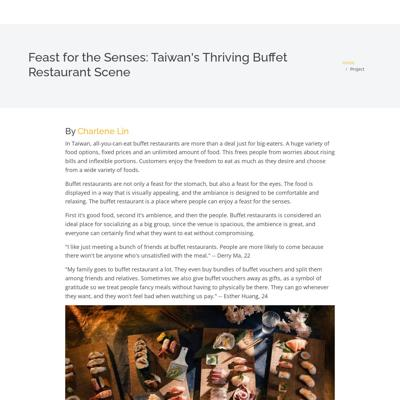](screenshots/charlenelin0824.github.io/fancy-buffet_index.html-wide-full.jpg)|
|[Karen Unmasked: Why We Rarely Talk About Violence and Non-Physcial Aggression Among Women](https://charlenelin0824.github.io/female-aggression-and-Karens/) :x: og:title :x: og:description :x: og:image [how to fix](https://jonathansoma.com/everything/web/social-tags/)||[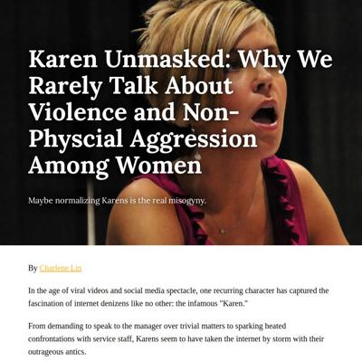](screenshots/charlenelin0824.github.io/female-aggression-and-Karens_index.html-medium-full.jpg)||

### Automatic Checks

**https://charlenelin0824.github.io/**

* Has sideways scrollbars in mobile version – check padding, margins, image widths

**https://charlenelin0824.github.io/BBC-film-project/**

* Change URL to be all in lowercase
* Has sideways scrollbars in mobile version – check padding, margins, image widths
* 🤖 [Automatic feedback for copy edits](feedback/charlenelin0824.github.io/BBC-film-project_index.html.md)

**https://charlenelin0824.github.io/deadly-sweet/**

* Has sideways scrollbars in mobile version – check padding, margins, image widths
* 🤖 [Automatic feedback for copy edits](feedback/charlenelin0824.github.io/deadly-sweet_index.html.md)

**https://charlenelin0824.github.io/fancy-buffet/**

* 🤖 [Automatic feedback here](feedback/charlenelin0824.github.io/fancy-buffet_index.html.md)
* No issues found! 🎉

**https://charlenelin0824.github.io/female-aggression-and-Karens/**

* Change URL to be all in lowercase
* Image(s) need `alt` tags, [info here](https://abilitynet.org.uk/news-blogs/five-golden-rules-compliant-alt-text) and [tips here](https://twitter.com/FrankElavsky/status/1469023374529765385)
    * Image `book-hardcopy.png` missing `alt` tag
    * Image `https://static01.nyt.com/images/2024/02/01/multimedia/01eu-hungary-orban-2-ghkw/01eu-hungary-orban-2-ghkw-superJumbo.jpg?quality=75&auto=webp` missing `alt` tag
* Add a link to your project's GitHub repo, so people can review your code
* 🤖 [Automatic feedback for copy edits](feedback/charlenelin0824.github.io/female-aggression-and-Karens_index.html.md)

## dlaiu.github.io

|url|mobile|medium|wide|
|---|---|---|---|
|[index.html](https://dlaiu.github.io/) :x: og:title :x: og:description :x: og:image [how to fix](https://jonathansoma.com/everything/web/social-tags/)|[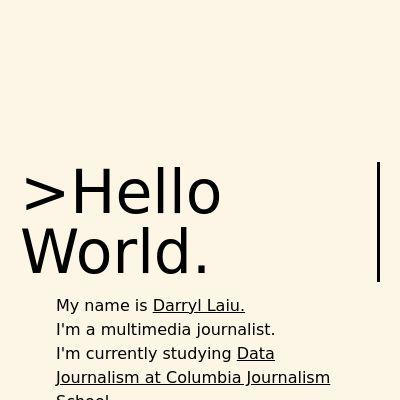](screenshots/dlaiu.github.io/index.html-mobile-full.jpg)||[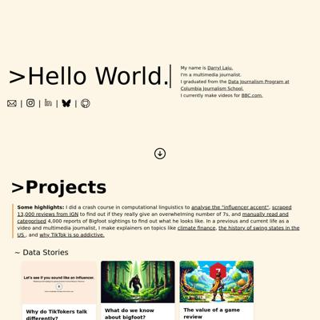](screenshots/dlaiu.github.io/index.html-wide-full.jpg)|
|[big-foot/index.html](https://dlaiu.github.io/big-foot) :x: og:title :x: og:description :x: og:image [how to fix](https://jonathansoma.com/everything/web/social-tags/)|request failed|request failed|request failed|
|[data-stories/ign-game-reviews/index.html](https://dlaiu.github.io/data-stories/ign-game-reviews) :x: og:title :x: og:description :x: og:image [how to fix](https://jonathansoma.com/everything/web/social-tags/)|request failed|request failed|request failed|
|[Why do all malls in Singapore feel the same?](https://dlaiu.github.io/generic-malls-singapore/) :x: og:title :x: og:description :x: og:image [how to fix](https://jonathansoma.com/everything/web/social-tags/)|[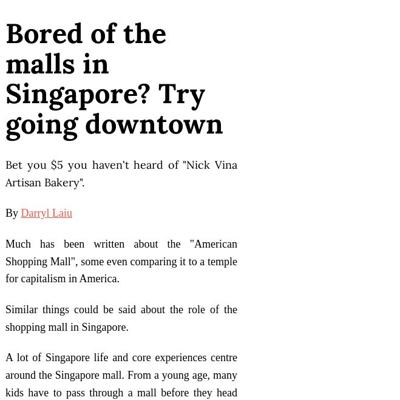](screenshots/dlaiu.github.io/generic-malls-singapore_index.html-mobile-full.jpg)|[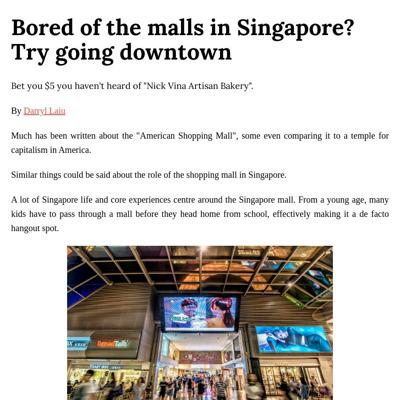](screenshots/dlaiu.github.io/generic-malls-singapore_index.html-medium-full.jpg)|[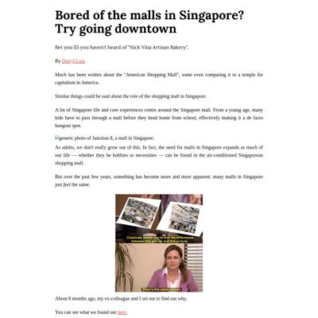](screenshots/dlaiu.github.io/generic-malls-singapore_index.html-wide-full.jpg)|
|[When was the best SNL era, objectively](https://dlaiu.github.io/snl-dream-team/) :x: og:title :x: og:description :x: og:image [how to fix](https://jonathansoma.com/everything/web/social-tags/)|[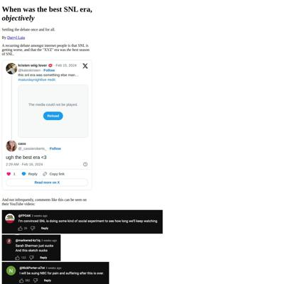](screenshots/dlaiu.github.io/snl-dream-team_index.html-mobile-full.jpg)|[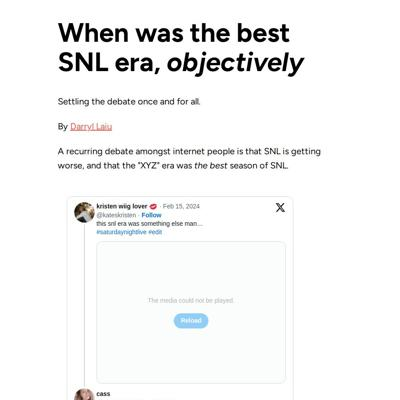](screenshots/dlaiu.github.io/snl-dream-team_index.html-medium-full.jpg)|[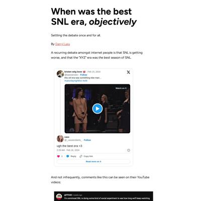](screenshots/dlaiu.github.io/snl-dream-team_index.html-wide-full.jpg)|

### Automatic Checks

**https://dlaiu.github.io/**

* Needs a title, add a `<title>` tag to the `<head>`

**https://dlaiu.github.io/big-foot**

* **Could not access the page** - if you moved it, [let me know](https://github.com/jsoma/data-studio-projects-2024/issues/new/choose)!
* 🤖 [Automatic feedback for copy edits](feedback/dlaiu.github.io/big-foot_index.html.md)

**https://dlaiu.github.io/data-stories/ign-game-reviews**

* **Could not access the page** - if you moved it, [let me know](https://github.com/jsoma/data-studio-projects-2024/issues/new/choose)!
* 🤖 [Automatic feedback for copy edits](feedback/dlaiu.github.io/data-stories_ign-game-reviews_index.html.md)

**https://dlaiu.github.io/generic-malls-singapore/**

* 🤖 [Automatic feedback here](feedback/dlaiu.github.io/generic-malls-singapore_index.html.md)
* No issues found! 🎉

**https://dlaiu.github.io/snl-dream-team/**

* Has sideways scrollbars in mobile version – check padding, margins, image widths
* 🤖 [Automatic feedback for copy edits](feedback/dlaiu.github.io/snl-dream-team_index.html.md)

## github.com

|url|mobile|medium|wide|
|---|---|---|---|
|[Page not found · GitHub · GitHub](https://github.com/katrventura/tiktok-api)|request failed|request failed|request failed|

### Automatic Checks

**https://github.com/katrventura/tiktok-api**

* **Could not access the page** - if you moved it, [let me know](https://github.com/jsoma/data-studio-projects-2024/issues/new/choose)!
* 🤖 [Automatic feedback for copy edits](feedback/github.com/katrventura_tiktok-api_index.html.md)

## juliezhn.github.io

|url|mobile|medium|wide|
|---|---|---|---|
|[Julie Zhu Portfolio](https://juliezhn.github.io/) :x: og:title :x: og:description :x: og:image [how to fix](https://jonathansoma.com/everything/web/social-tags/)|||[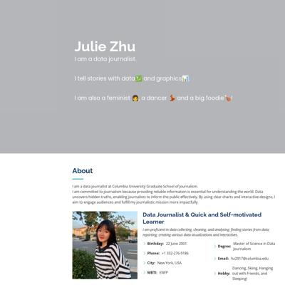](screenshots/juliezhn.github.io/index.html-wide-full.jpg)|
|[Page not found · GitHub Pages](https://juliezhn.github.io/food-delivery/) :x: og:title :x: og:description :x: og:image [how to fix](https://jonathansoma.com/everything/web/social-tags/)|request failed|request failed|request failed|
|[Page not found · GitHub Pages](https://juliezhn.github.io/julie-name/) :x: og:title :x: og:description :x: og:image [how to fix](https://jonathansoma.com/everything/web/social-tags/)|request failed|request failed|request failed|
|[Page not found · GitHub Pages](https://juliezhn.github.io/melting-polar-ice/) :x: og:title :x: og:description :x: og:image [how to fix](https://jonathansoma.com/everything/web/social-tags/)|request failed|request failed|request failed|
|[Page not found · GitHub Pages](https://juliezhn.github.io/nyc-dropout-rate/) :x: og:title :x: og:description :x: og:image [how to fix](https://jonathansoma.com/everything/web/social-tags/)|request failed|request failed|request failed|

### Automatic Checks

**https://juliezhn.github.io/**

* No issues found! 🎉

**https://juliezhn.github.io/food-delivery/**

* **Could not access the page** - if you moved it, [let me know](https://github.com/jsoma/data-studio-projects-2024/issues/new/choose)!
* 🤖 [Automatic feedback for copy edits](feedback/juliezhn.github.io/food-delivery_index.html.md)

**https://juliezhn.github.io/julie-name/**

* **Could not access the page** - if you moved it, [let me know](https://github.com/jsoma/data-studio-projects-2024/issues/new/choose)!
* 🤖 [Automatic feedback for copy edits](feedback/juliezhn.github.io/julie-name_index.html.md)

**https://juliezhn.github.io/melting-polar-ice/**

* **Could not access the page** - if you moved it, [let me know](https://github.com/jsoma/data-studio-projects-2024/issues/new/choose)!
* 🤖 [Automatic feedback for copy edits](feedback/juliezhn.github.io/melting-polar-ice_index.html.md)

**https://juliezhn.github.io/nyc-dropout-rate/**

* **Could not access the page** - if you moved it, [let me know](https://github.com/jsoma/data-studio-projects-2024/issues/new/choose)!
* 🤖 [Automatic feedback for copy edits](feedback/juliezhn.github.io/nyc-dropout-rate_index.html.md)

## katrventura.github.io

|url|mobile|medium|wide|
|---|---|---|---|
|[Portfolio Website](https://katrventura.github.io/) :x: og:title :x: og:description :x: og:image [how to fix](https://jonathansoma.com/everything/web/social-tags/)|||[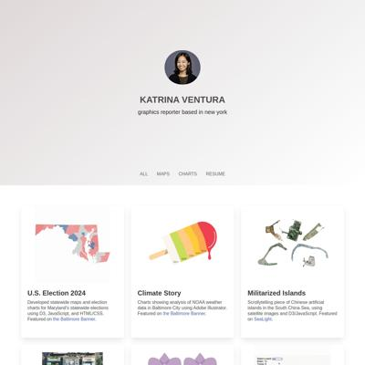](screenshots/katrventura.github.io/index.html-wide-full.jpg)|
|[Feminine Waves](https://katrventura.github.io/climate-turtle-gender/)|[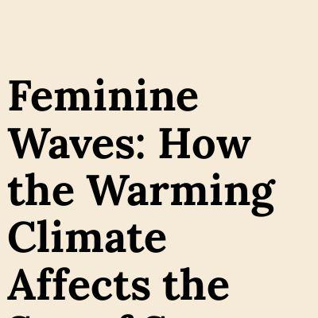](screenshots/katrventura.github.io/climate-turtle-gender_index.html-mobile-full.jpg)||[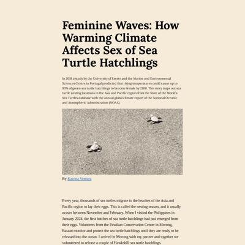](screenshots/katrventura.github.io/climate-turtle-gender_index.html-wide-full.jpg)|
|[2024 Elections](https://katrventura.github.io/elections-scraper/)||[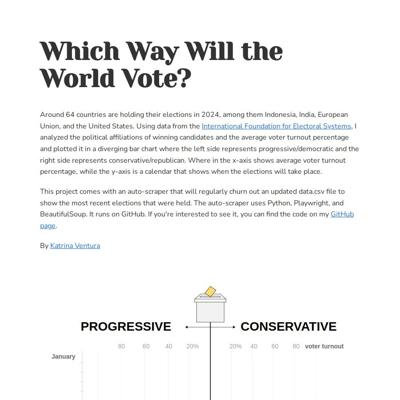](screenshots/katrventura.github.io/elections-scraper_index.html-medium-full.jpg)||
|[Cutting Orchids](https://katrventura.github.io/fgm-orchids/)|[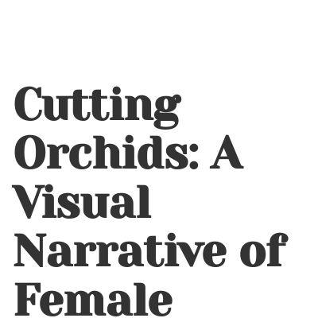](screenshots/katrventura.github.io/fgm-orchids_index.html-mobile-full.jpg)|||
|[West Philippine Sea](https://katrventura.github.io/west-ph-sea/) :x: og:title :x: og:description :x: og:image [how to fix](https://jonathansoma.com/everything/web/social-tags/)||||

### Automatic Checks

**https://katrventura.github.io/**

* Image(s) need `alt` tags, [info here](https://abilitynet.org.uk/news-blogs/five-golden-rules-compliant-alt-text) and [tips here](https://twitter.com/FrankElavsky/status/1469023374529765385)
    * Image `assets/headshot.jpg` missing `alt` tag

**https://katrventura.github.io/climate-turtle-gender/**

* 🤖 [Automatic feedback here](feedback/katrventura.github.io/climate-turtle-gender_index.html.md)
* No issues found! 🎉

**https://katrventura.github.io/elections-scraper/**

* Minimum font size should be 12px, enlarge text in CSS or Illustrator
    * Text `PROGRESSIVE` is too small at 10px
    * Text `CONSERVATIVE` is too small at 10px
    * Text `voter turnout` is too small at 8px
    * Text `60` is too small at 6px
    * Text `40` is too small at 6px
    * Text `20%` is too small at 6px
    * Text `20%` is too small at 6px
    * *and 131 more*
* 🤖 [Automatic feedback for copy edits](feedback/katrventura.github.io/elections-scraper_index.html.md)

**https://katrventura.github.io/fgm-orchids/**

* Minimum font size should be 12px, enlarge text in CSS or Illustrator
    * Text `TYPE 1` is too small at 10px
    * Text `Partial or total removal of` is too small at 10px
    * Text `clitoral glans` is too small at 10px
    * Text `TYPE 2` is too small at 10px
    * Text `Partial or total removal of` is too small at 10px
    * Text `clitoral glans and labia` is too small at 10px
    * *and 64 more*
* 🤖 [Automatic feedback for copy edits](feedback/katrventura.github.io/fgm-orchids_index.html.md)

**https://katrventura.github.io/west-ph-sea/**

* Image(s) need `alt` tags, [info here](https://abilitynet.org.uk/news-blogs/five-golden-rules-compliant-alt-text) and [tips here](https://twitter.com/FrankElavsky/status/1469023374529765385)
    * Image `military-bases.png` missing `alt` tag
    * Image `mischief-1.png` missing `alt` tag
* 🤖 [Automatic feedback for copy edits](feedback/katrventura.github.io/west-ph-sea_index.html.md)

## lauramiina.github.io

|url|mobile|medium|wide|
|---|---|---|---|
|[Laura Kukkonen](https://lauramiina.github.io/) :x: og:title :x: og:description :x: og:image [how to fix](https://jonathansoma.com/everything/web/social-tags/)|[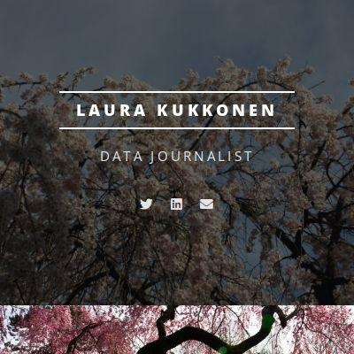](screenshots/lauramiina.github.io/index.html-mobile-full.jpg)||[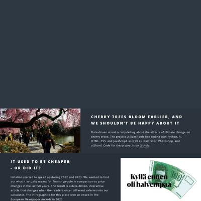](screenshots/lauramiina.github.io/index.html-wide-full.jpg)|
|[ASMR](https://lauramiina.github.io/asmr-project/)||[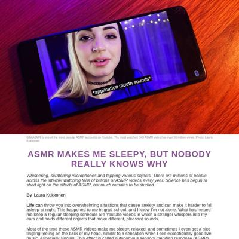](screenshots/lauramiina.github.io/asmr-project_index.html-medium-full.jpg)|[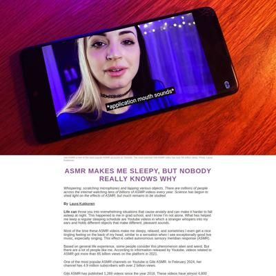](screenshots/lauramiina.github.io/asmr-project_index.html-wide-full.jpg)|
|[Cherry Trees](https://lauramiina.github.io/cherry-trees/)|[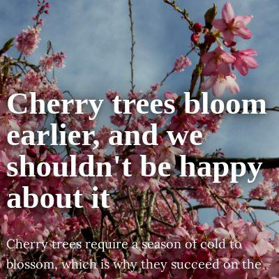](screenshots/lauramiina.github.io/cherry-trees_index.html-mobile-full.jpg)|[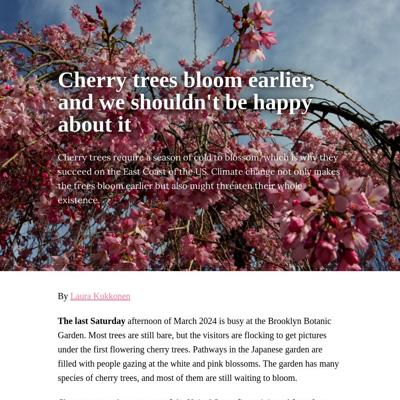](screenshots/lauramiina.github.io/cherry-trees_index.html-medium-full.jpg)|[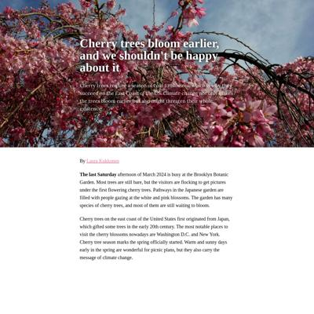](screenshots/lauramiina.github.io/cherry-trees_index.html-wide-full.jpg)|
|[Climbing holds](https://lauramiina.github.io/climbing-holds/)||[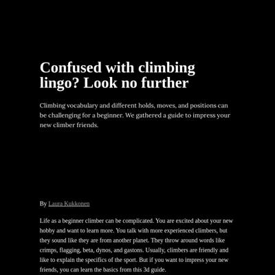](screenshots/lauramiina.github.io/climbing-holds_index.html-medium-full.jpg)|[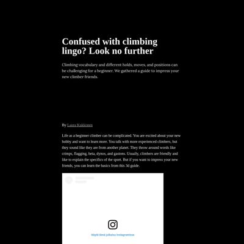](screenshots/lauramiina.github.io/climbing-holds_index.html-wide-full.jpg)|
|[Forest](https://lauramiina.github.io/nybg-forest/)||[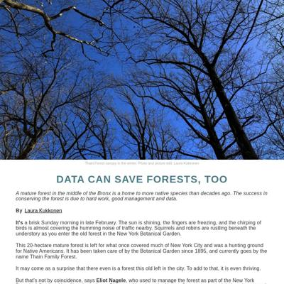](screenshots/lauramiina.github.io/nybg-forest_index.html-medium-full.jpg)|[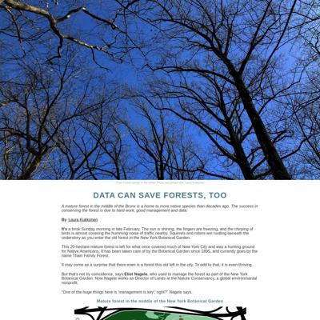](screenshots/lauramiina.github.io/nybg-forest_index.html-wide-full.jpg)|
|[Sauna](https://lauramiina.github.io/suomi-sauna/) :x: og:title :x: og:description :x: og:image [how to fix](https://jonathansoma.com/everything/web/social-tags/)||||

### Automatic Checks

**https://lauramiina.github.io/**

* No issues found! 🎉

**https://lauramiina.github.io/asmr-project/**

* 🤖 [Automatic feedback here](feedback/lauramiina.github.io/asmr-project_index.html.md)
* No issues found! 🎉

**https://lauramiina.github.io/cherry-trees/**

* Image(s) need `alt` tags, [info here](https://abilitynet.org.uk/news-blogs/five-golden-rules-compliant-alt-text) and [tips here](https://twitter.com/FrankElavsky/status/1469023374529765385)
    * Image `cherry9.jpg` missing `alt` tag
    * Image `cherry4.jpg` missing `alt` tag
    * Image `cherry3.jpg` missing `alt` tag
* Minimum font size should be 12px, enlarge text in CSS or Illustrator
    * Text `April 17` is too small at 9px
    * Text `April 7` is too small at 9px
    * Text `March 28` is too small at 9px
    * Text `March 18` is too small at 9px
    * Text `March 8` is too small at 9px
    * Text `1920` is too small at 9px
    * Text `1940` is too small at 9px
    * *and 14 more*
* 🤖 [Automatic feedback for copy edits](feedback/lauramiina.github.io/cherry-trees_index.html.md)

**https://lauramiina.github.io/climbing-holds/**

* Image(s) need `alt` tags, [info here](https://abilitynet.org.uk/news-blogs/five-golden-rules-compliant-alt-text) and [tips here](https://twitter.com/FrankElavsky/status/1469023374529765385)
    * Image `https://modelviewer.dev/shared-assets/icons/hand.png` missing `alt` tag
    * Image `https://modelviewer.dev/shared-assets/icons/hand.png` missing `alt` tag
    * Image `https://modelviewer.dev/shared-assets/icons/hand.png` missing `alt` tag
* 🤖 [Automatic feedback for copy edits](feedback/lauramiina.github.io/climbing-holds_index.html.md)

**https://lauramiina.github.io/nybg-forest/**

* Minimum font size should be 12px, enlarge text in CSS or Illustrator
    * Text `Oaks` is too small at 9px
    * Text `Eastern hemlock` is too small at 9px
    * Text `30 %` is too small at 10px
    * Text `Eastern hemlock` is too small at 8px
    * Text `Share of count` is too small at 8px
    * Text `Share of plant area` is too small at 8px
    * Text `Oaks` is too small at 8px
    * *and 52 more*
* 🤖 [Automatic feedback for copy edits](feedback/lauramiina.github.io/nybg-forest_index.html.md)

**https://lauramiina.github.io/suomi-sauna/**

* Has sideways scrollbars in mobile version – check padding, margins, image widths
* 🤖 [Automatic feedback for copy edits](feedback/lauramiina.github.io/suomi-sauna_index.html.md)

## mandiuu.github.io

|url|mobile|medium|wide|
|---|---|---|---|
|[Carla's Portfolio](https://mandiuu.github.io/) :x: og:title :x: og:description :x: og:image [how to fix](https://jonathansoma.com/everything/web/social-tags/)||||
|[✨All that glitters is not gold: the downfall of trying to use NY Data✨](https://mandiuu.github.io/baby/)||||
|[Where is your bike in the city?](https://mandiuu.github.io/Citi_Bike/) :x: og:image [how to fix](https://jonathansoma.com/everything/web/social-tags/)||||
|[Shiny Happy People](https://mandiuu.github.io/happiness) :x: og:image [how to fix](https://jonathansoma.com/everything/web/social-tags/)||||
|[Toy Story](https://mandiuu.github.io/toystory/) :x: og:image [how to fix](https://jonathansoma.com/everything/web/social-tags/)||||
|[Wine in NYC](https://mandiuu.github.io/wine) :x: og:title :x: og:description :x: og:image [how to fix](https://jonathansoma.com/everything/web/social-tags/)||||

### Automatic Checks

**https://mandiuu.github.io/**

* Image(s) need `alt` tags, [info here](https://abilitynet.org.uk/news-blogs/five-golden-rules-compliant-alt-text) and [tips here](https://twitter.com/FrankElavsky/status/1469023374529765385)
    * Image `https://modelviewer.dev/shared-assets/icons/hand.png` missing `alt` tag

**https://mandiuu.github.io/baby/**

* 🤖 [Automatic feedback here](feedback/mandiuu.github.io/baby_index.html.md)
* No issues found! 🎉

**https://mandiuu.github.io/Citi_Bike/**

* Change URL to use `-` instead of spaces or underscores
* Change URL to be all in lowercase
* Minimum font size should be 12px, enlarge text in CSS or Illustrator
    * Text `No bikes here` is too small at 9px
    * Text `Bronx` is too small at 9px
    * Text `Manhattan` is too small at 9px
    * Text `Queens` is too small at 9px
    * Text `No bikes here either` is too small at 9px
    * Text `Brooklyn` is too small at 9px
    * Text `Or here` is too small at 9px
    * *and 4 more*
* 🤖 [Automatic feedback for copy edits](feedback/mandiuu.github.io/Citi_Bike_index.html.md)

**https://mandiuu.github.io/happiness**

* Has sideways scrollbars in mobile version – check padding, margins, image widths
* 🤖 [Automatic feedback for copy edits](feedback/mandiuu.github.io/happiness_index.html.md)

**https://mandiuu.github.io/toystory/**

* Image(s) need `alt` tags, [info here](https://abilitynet.org.uk/news-blogs/five-golden-rules-compliant-alt-text) and [tips here](https://twitter.com/FrankElavsky/status/1469023374529765385)
    * Image `https://modelviewer.dev/shared-assets/icons/hand.png` missing `alt` tag
    * Image `https://modelviewer.dev/shared-assets/icons/hand.png` missing `alt` tag
    * Image `https://modelviewer.dev/shared-assets/icons/hand.png` missing `alt` tag
* 🤖 [Automatic feedback for copy edits](feedback/mandiuu.github.io/toystory_index.html.md)

**https://mandiuu.github.io/wine**

* Image(s) need `alt` tags, [info here](https://abilitynet.org.uk/news-blogs/five-golden-rules-compliant-alt-text) and [tips here](https://twitter.com/FrankElavsky/status/1469023374529765385)
    * Image `GFajZOEXgAAXHJZ.jpeg` missing `alt` tag
    * Image `prices.png` missing `alt` tag
* 🤖 [Automatic feedback for copy edits](feedback/mandiuu.github.io/wine_index.html.md)

## meghnadbose.github.io

|url|mobile|medium|wide|
|---|---|---|---|
|[Meghnad Bose  Award-winning multimedia journalist](https://meghnadbose.github.io/)||||
|[Interactive: How Accurately Can You Guess India's Press Freedom Trajectory Since Modi Became PM in 2014?](https://meghnadbose.github.io/india-trajectory-under-modi/)||||
|[In Election Year, Religious Issues and Opposition-Bashing Dominate Primetime TV News in India](https://meghnadbose.github.io/indian-tv-media-coverage-analysis/)||||
|[When Walls Breaks Barriers: How Irish Solidarity With Palestine Is Expressing Itself Through Art](https://meghnadbose.github.io/ireland-palestine-solidarity-art)||||
|[We Ranked the Purple States of the 2024 US Presidential Election. Here Are The Swingiest States of Them All](https://meghnadbose.github.io/purple-states-us-presidential-election/)||||
|[More Results, Closer Matches in Tests Now: But Will That Be Enough to Save Cricket’s 5-Day Format?](https://meghnadbose.github.io/test-cricket)||||

### Automatic Checks

**https://meghnadbose.github.io/**

* No issues found! 🎉

**https://meghnadbose.github.io/india-trajectory-under-modi/**

* Has sideways scrollbars in mobile version – check padding, margins, image widths
* Add a link to your project's GitHub repo, so people can review your code
* 🤖 [Automatic feedback for copy edits](feedback/meghnadbose.github.io/india-trajectory-under-modi_index.html.md)

**https://meghnadbose.github.io/indian-tv-media-coverage-analysis/**

* 🤖 [Automatic feedback here](feedback/meghnadbose.github.io/indian-tv-media-coverage-analysis_index.html.md)
* No issues found! 🎉

**https://meghnadbose.github.io/ireland-palestine-solidarity-art**

* Image(s) need `alt` tags, [info here](https://abilitynet.org.uk/news-blogs/five-golden-rules-compliant-alt-text) and [tips here](https://twitter.com/FrankElavsky/status/1469023374529765385)
    * Image `Samia.jpg` missing `alt` tag
    * Image `Masa.jpg` missing `alt` tag
    * Image `Dublin-1.jpg` missing `alt` tag
* Add a link to your project's GitHub repo, so people can review your code
* 🤖 [Automatic feedback for copy edits](feedback/meghnadbose.github.io/ireland-palestine-solidarity-art_index.html.md)

**https://meghnadbose.github.io/purple-states-us-presidential-election/**

* Minimum font size should be 12px, enlarge text in CSS or Illustrator
    * Text `Won by Biden in 2020` is too small at 10px
    * Text `Won by Trump in 2020` is too small at 10px
    * Text `North Dakota` is too small at 9px
    * Text `Pennsylvania` is too small at 9px
    * Text `Wisconsin` is too small at 9px
    * Text `Michigan` is too small at 9px
    * Text `Tennessee` is too small at 9px
    * *and 3 more*
* 🤖 [Automatic feedback for copy edits](feedback/meghnadbose.github.io/purple-states-us-presidential-election_index.html.md)

**https://meghnadbose.github.io/test-cricket**

* Has sideways scrollbars in mobile version – check padding, margins, image widths
* 🤖 [Automatic feedback for copy edits](feedback/meghnadbose.github.io/test-cricket_index.html.md)

## mjdanbury.github.io

|url|mobile|medium|wide|
|---|---|---|---|
|[Matthew Danbury](https://mjdanbury.github.io/) :x: og:title :x: og:description :x: og:image [how to fix](https://jonathansoma.com/everything/web/social-tags/)||||
|[Ingredient Households Have It Better](https://mjdanbury.github.io/food-recalls/) :x: og:title :x: og:description :x: og:image [how to fix](https://jonathansoma.com/everything/web/social-tags/)||||
|[Upended](https://mjdanbury.github.io/pandemic-changes-311/) :x: og:title :x: og:description :x: og:image [how to fix](https://jonathansoma.com/everything/web/social-tags/)||||
|[What Makes For A Great Pizza Crust?](https://mjdanbury.github.io/PIZZA-PIZZA/) :x: og:title :x: og:description :x: og:image [how to fix](https://jonathansoma.com/everything/web/social-tags/)||||
|[Where Credit Is Due](https://mjdanbury.github.io/song-credits/) :x: og:title :x: og:description :x: og:image [how to fix](https://jonathansoma.com/everything/web/social-tags/)||||

### Automatic Checks

**https://mjdanbury.github.io/**

* No issues found! 🎉

**https://mjdanbury.github.io/food-recalls/**

* Has sideways scrollbars in mobile version – check padding, margins, image widths
* 🤖 [Automatic feedback for copy edits](feedback/mjdanbury.github.io/food-recalls_index.html.md)

**https://mjdanbury.github.io/pandemic-changes-311/**

* Image(s) need `alt` tags, [info here](https://abilitynet.org.uk/news-blogs/five-golden-rules-compliant-alt-text) and [tips here](https://twitter.com/FrankElavsky/status/1469023374529765385)
    * Image `charts-up/0.svg` missing `alt` tag
    * Image `charts-up/4.svg` missing `alt` tag
    * Image `charts-up/18.svg` missing `alt` tag
    * Image `charts-up/23.svg` missing `alt` tag
    * Image `charts-up/35.svg` missing `alt` tag
    * *and 59 more*
* 🤖 [Automatic feedback for copy edits](feedback/mjdanbury.github.io/pandemic-changes-311_index.html.md)

**https://mjdanbury.github.io/PIZZA-PIZZA/**

* Change URL to be all in lowercase
* Has sideways scrollbars in mobile version – check padding, margins, image widths
* 🤖 [Automatic feedback for copy edits](feedback/mjdanbury.github.io/PIZZA-PIZZA_index.html.md)

**https://mjdanbury.github.io/song-credits/**

* 🤖 [Automatic feedback here](feedback/mjdanbury.github.io/song-credits_index.html.md)
* No issues found! 🎉

## ml4998.github.io

|url|mobile|medium|wide|
|---|---|---|---|
|[Mariam Lobjanidze](https://ml4998.github.io/)||||
|[Lesbian Bars](https://ml4998.github.io/Lesbianbars/) :x: og:title :x: og:description :x: og:image [how to fix](https://jonathansoma.com/everything/web/social-tags/)||||
|[Story template](https://ml4998.github.io/MOMA/) :x: og:title :x: og:description :x: og:image [how to fix](https://jonathansoma.com/everything/web/social-tags/)||||
|[NYC arcitecture](https://ml4998.github.io/NYCbuildings/) :x: og:title :x: og:description :x: og:image [how to fix](https://jonathansoma.com/everything/web/social-tags/)||||
|[Story template](https://ml4998.github.io/nycresidents/) :x: og:title :x: og:description :x: og:image [how to fix](https://jonathansoma.com/everything/web/social-tags/)||||
|[Story template](https://ml4998.github.io/Pizza-styles/) :x: og:title :x: og:description :x: og:image [how to fix](https://jonathansoma.com/everything/web/social-tags/)||||

### Automatic Checks

**https://ml4998.github.io/**

* No issues found! 🎉

**https://ml4998.github.io/Lesbianbars/**

* Change URL to be all in lowercase
* Image(s) need `alt` tags, [info here](https://abilitynet.org.uk/news-blogs/five-golden-rules-compliant-alt-text) and [tips here](https://twitter.com/FrankElavsky/status/1469023374529765385)
    * Image `cubbylong.jpg` missing `alt` tag
    * Image `jakayla.jpg` missing `alt` tag
    * Image `inside.jpg` missing `alt` tag
* 🤖 [Automatic feedback for copy edits](feedback/ml4998.github.io/Lesbianbars_index.html.md)

**https://ml4998.github.io/MOMA/**

* Change URL to be all in lowercase
* Image(s) need `alt` tags, [info here](https://abilitynet.org.uk/news-blogs/five-golden-rules-compliant-alt-text) and [tips here](https://twitter.com/FrankElavsky/status/1469023374529765385)
    * Image `6.jpg` missing `alt` tag
    * Image `artistsbycont.png` missing `alt` tag
    * Image `artistsbygender.png` missing `alt` tag
    * Image `4.jpg` missing `alt` tag
* 🤖 [Automatic feedback for copy edits](feedback/ml4998.github.io/MOMA_index.html.md)

**https://ml4998.github.io/NYCbuildings/**

* Change URL to be all in lowercase
* 🤖 [Automatic feedback for copy edits](feedback/ml4998.github.io/NYCbuildings_index.html.md)

**https://ml4998.github.io/nycresidents/**

* 🤖 [Automatic feedback here](feedback/ml4998.github.io/nycresidents_index.html.md)
* No issues found! 🎉

**https://ml4998.github.io/Pizza-styles/**

* Change URL to be all in lowercase
* Image(s) need `alt` tags, [info here](https://abilitynet.org.uk/news-blogs/five-golden-rules-compliant-alt-text) and [tips here](https://twitter.com/FrankElavsky/status/1469023374529765385)
    * Image `sicillian.jpg` missing `alt` tag
    * Image `deepdish.jpg` missing `alt` tag
    * Image `supreme.jpg` missing `alt` tag
    * Image `chart.png` missing `alt` tag
* 🤖 [Automatic feedback for copy edits](feedback/ml4998.github.io/Pizza-styles_index.html.md)

## pettravel.streamlit.app

|url|mobile|medium|wide|
|---|---|---|---|
|[Reuniting with your pet · Streamlit](https://pettravel.streamlit.app/) :x: og:title :x: og:description :x: og:image [how to fix](https://jonathansoma.com/everything/web/social-tags/)||||

### Automatic Checks

**https://pettravel.streamlit.app/**

* No issues found! 🎉

## radhika3558.github.io

|url|mobile|medium|wide|
|---|---|---|---|
|[Radhika Rukmangadhan](https://radhika3558.github.io/)||||
|[Cash Crunch](https://radhika3558.github.io/cash-circulation/)||||
|[Sticker shock: Prescription drug prices in the US vs the world](https://radhika3558.github.io/pharma-prices/)||||
|[Rainy Weekends](https://radhika3558.github.io/rainy-weekends/)||||
|[Butte Creek](https://radhika3558.github.io/salmon-butte-creek/)||||
|[Bedroom in Arles](https://radhika3558.github.io/van-gogh-3d/)||||

### Automatic Checks

**https://radhika3558.github.io/**

* No issues found! 🎉

**https://radhika3558.github.io/cash-circulation/**

* Has sideways scrollbars in mobile version – check padding, margins, image widths
* 🤖 [Automatic feedback for copy edits](feedback/radhika3558.github.io/cash-circulation_index.html.md)

**https://radhika3558.github.io/pharma-prices/**

* 🤖 [Automatic feedback here](feedback/radhika3558.github.io/pharma-prices_index.html.md)
* No issues found! 🎉

**https://radhika3558.github.io/rainy-weekends/**

* Has sideways scrollbars in mobile version – check padding, margins, image widths
* 🤖 [Automatic feedback for copy edits](feedback/radhika3558.github.io/rainy-weekends_index.html.md)

**https://radhika3558.github.io/salmon-butte-creek/**

* Has sideways scrollbars in mobile version – check padding, margins, image widths
* Minimum font size should be 12px, enlarge text in CSS or Illustrator
    * Text `$9B` is too small at 9px
    * Text `$1.9B` is too small at 7px
    * Text `$1.7B` is too small at 7px
    * Text `IL` is too small at 10px
    * Text `WV` is too small at 9px
    * Text `$1.6B` is too small at 7px
    * Text `$1B` is too small at 7px
    * *and 25 more*
* 🤖 [Automatic feedback for copy edits](feedback/radhika3558.github.io/salmon-butte-creek_index.html.md)

**https://radhika3558.github.io/van-gogh-3d/**

* Image(s) need `alt` tags, [info here](https://abilitynet.org.uk/news-blogs/five-golden-rules-compliant-alt-text) and [tips here](https://twitter.com/FrankElavsky/status/1469023374529765385)
    * Image `https://modelviewer.dev/shared-assets/icons/hand.png` missing `alt` tag
* 🤖 [Automatic feedback for copy edits](feedback/radhika3558.github.io/van-gogh-3d_index.html.md)

## renatadaou.github.io

|url|mobile|medium|wide|
|---|---|---|---|
|[Renata Carlos Daou](https://renatadaou.github.io/) :x: og:title :x: og:description :x: og:image [how to fix](https://jonathansoma.com/everything/web/social-tags/)||||
|[How Are Journalists Covering Stories in Gaza?](https://renatadaou.github.io/journalists-covering-Gaza/)||||
|[Syrian Refugees](https://renatadaou.github.io/migration)||||
|[Page not found · GitHub Pages](https://renatadaou.github.io/SoulCycle-vs-CycleBar/) :x: og:title :x: og:description :x: og:image [how to fix](https://jonathansoma.com/everything/web/social-tags/)|request failed|request failed|request failed|
|[I Asked Four Young Women What Their Favorite Countries Are](https://renatadaou.github.io/travel/)||||
|[Page not found · GitHub Pages](https://renatadaou.github.io/Wildfires-in-Amazonas-2023/) :x: og:title :x: og:description :x: og:image [how to fix](https://jonathansoma.com/everything/web/social-tags/)|request failed|request failed|request failed|

### Automatic Checks

**https://renatadaou.github.io/**

* No issues found! 🎉

**https://renatadaou.github.io/journalists-covering-Gaza/**

* Change URL to be all in lowercase
* Image(s) need `alt` tags, [info here](https://abilitynet.org.uk/news-blogs/five-golden-rules-compliant-alt-text) and [tips here](https://twitter.com/FrankElavsky/status/1469023374529765385)
    * Image `mprnew.jpg` missing `alt` tag
    * Image `dallasnew.jpg` missing `alt` tag
    * Image `mprnew.jpg` missing `alt` tag
* 🤖 [Automatic feedback for copy edits](feedback/renatadaou.github.io/journalists-covering-Gaza_index.html.md)

**https://renatadaou.github.io/migration**

* Minimum font size should be 12px, enlarge text in CSS or Illustrator
    * Text `Malta` is too small at 10px
* 🤖 [Automatic feedback for copy edits](feedback/renatadaou.github.io/migration_index.html.md)

**https://renatadaou.github.io/SoulCycle-vs-CycleBar/**

* **Could not access the page** - if you moved it, [let me know](https://github.com/jsoma/data-studio-projects-2024/issues/new/choose)!
* 🤖 [Automatic feedback for copy edits](feedback/renatadaou.github.io/SoulCycle-vs-CycleBar_index.html.md)

**https://renatadaou.github.io/travel/**

* Image(s) need `alt` tags, [info here](https://abilitynet.org.uk/news-blogs/five-golden-rules-compliant-alt-text) and [tips here](https://twitter.com/FrankElavsky/status/1469023374529765385)
    * Image `pics/hannah1.jpg` missing `alt` tag
    * Image `pics/hannah5.jpg` missing `alt` tag
    * Image `pics/hannah2.jpg` missing `alt` tag
    * Image `pics/hannah3.jpg` missing `alt` tag
    * Image `pics/lorenaegypt6.JPG` missing `alt` tag
    * *and 8 more*
* 🤖 [Automatic feedback for copy edits](feedback/renatadaou.github.io/travel_index.html.md)

**https://renatadaou.github.io/Wildfires-in-Amazonas-2023/**

* **Could not access the page** - if you moved it, [let me know](https://github.com/jsoma/data-studio-projects-2024/issues/new/choose)!
* 🤖 [Automatic feedback for copy edits](feedback/renatadaou.github.io/Wildfires-in-Amazonas-2023_index.html.md)

## sabinahung.github.io

|url|mobile|medium|wide|
|---|---|---|---|
|[Sabina Hung](https://sabinahung.github.io/)||||
|[Dumpster Dive for the environment](https://sabinahung.github.io/dumpster-dive/)||||
|[Everything, Everywhere, All about Anti-China Politics](https://sabinahung.github.io/falungong/)||||
|[An Island Divided by Disinformation](https://sabinahung.github.io/gay-marriage-disinformation/)||||
|[Has Taiwan become a cat state?](https://sabinahung.github.io/pet-ownership-taiwan/)||||

### Automatic Checks

**https://sabinahung.github.io/**

* No issues found! 🎉

**https://sabinahung.github.io/dumpster-dive/**

* Minimum font size should be 12px, enlarge text in CSS or Illustrator
    * Text `141` is too small at 10px
    * Text `2023` is too small at 9px
    * Text `2022` is too small at 9px
    * Text `2021` is too small at 9px
    * Text `2020` is too small at 9px
    * Text `2019` is too small at 9px
    * Text `2018` is too small at 9px
    * *and 11 more*
* 🤖 [Automatic feedback for copy edits](feedback/sabinahung.github.io/dumpster-dive_index.html.md)

**https://sabinahung.github.io/falungong/**

* Minimum font size should be 12px, enlarge text in CSS or Illustrator
    * Text `Chinese` is too small at 10px
    * Text `17.6` is too small at 10px
    * Text `17.6` is too small at 10px
    * Text `13.9` is too small at 10px
    * Text `7.4` is too small at 10px
    * Text `13` is too small at 10px
    * Text `
                Practitioners’ household income (USD) by percentage in
                Boston 2002
              ` is too small at 10px
    * *and 10 more*
* 🤖 [Automatic feedback for copy edits](feedback/sabinahung.github.io/falungong_index.html.md)

**https://sabinahung.github.io/gay-marriage-disinformation/**

* 🤖 [Automatic feedback here](feedback/sabinahung.github.io/gay-marriage-disinformation_index.html.md)
* No issues found! 🎉

**https://sabinahung.github.io/pet-ownership-taiwan/**

* 🤖 [Automatic feedback here](feedback/sabinahung.github.io/pet-ownership-taiwan_index.html.md)
* No issues found! 🎉

## shivangibishnoi.github.io

|url|mobile|medium|wide|
|---|---|---|---|
|[Shivangi Bishnoi](https://shivangibishnoi.github.io) :x: og:title :x: og:description :x: og:image [how to fix](https://jonathansoma.com/everything/web/social-tags/)||||
|[Aerosole Debate](https://shivangibishnoi.github.io/aerosols-and-clouds/)||||
|[Flood Insurance](https://shivangibishnoi.github.io/flood-insurance/index.html)||||
|[21 Days and a Lifetime](https://shivangibishnoi.github.io/ladakh/) :x: og:title :x: og:description :x: og:image [how to fix](https://jonathansoma.com/everything/web/social-tags/)||||
|[Flood Policy Moral Hazard](https://shivangibishnoi.github.io/moral-hazard/) :x: og:title :x: og:description :x: og:image [how to fix](https://jonathansoma.com/everything/web/social-tags/)||||
|[Yoga story](https://shivangibishnoi.github.io/yoga-in-us/)||||

### Automatic Checks

**https://shivangibishnoi.github.io**

* No issues found! 🎉

**https://shivangibishnoi.github.io/aerosols-and-clouds/**

* Has sideways scrollbars in mobile version – check padding, margins, image widths
* 🤖 [Automatic feedback for copy edits](feedback/shivangibishnoi.github.io/aerosols-and-clouds_index.html.md)

**https://shivangibishnoi.github.io/flood-insurance/index.html**

* Minimum font size should be 12px, enlarge text in CSS or Illustrator
    * Text `+50%` is too small at 8px
    * Text `0%` is too small at 8px
    * Text `-+10%` is too small at 8px
    * Text `+50%` is too small at 8px
    * Text `0%` is too small at 8px
    * Text `-+10%` is too small at 8px
    * Text `0.5x` is too small at 9px
    * *and 49 more*
* 🤖 [Automatic feedback for copy edits](feedback/shivangibishnoi.github.io/flood-insurance_index.html.md)

**https://shivangibishnoi.github.io/ladakh/**

* Image(s) need `alt` tags, [info here](https://abilitynet.org.uk/news-blogs/five-golden-rules-compliant-alt-text) and [tips here](https://twitter.com/FrankElavsky/status/1469023374529765385)
    * Image `wangchuk.jpg` missing `alt` tag
    * Image `stupa.gif` missing `alt` tag
* Add a link to your project's GitHub repo, so people can review your code
* 🤖 [Automatic feedback for copy edits](feedback/shivangibishnoi.github.io/ladakh_index.html.md)

**https://shivangibishnoi.github.io/moral-hazard/**

* Has sideways scrollbars in mobile version – check padding, margins, image widths
* Minimum font size should be 12px, enlarge text in CSS or Illustrator
    * Text `0.02` is too small at 9px
    * Text `0.04` is too small at 9px
    * Text `0.02` is too small at 9px
    * Text `0.02` is too small at 9px
    * Text `0.04` is too small at 9px
    * Text `0.02` is too small at 9px
    * Text `1990` is too small at 9px
    * *and 8 more*
* 🤖 [Automatic feedback for copy edits](feedback/shivangibishnoi.github.io/moral-hazard_index.html.md)

**https://shivangibishnoi.github.io/yoga-in-us/**

* 🤖 [Automatic feedback here](feedback/shivangibishnoi.github.io/yoga-in-us_index.html.md)
* No issues found! 🎉

## thomastaoli.github.io

|url|mobile|medium|wide|
|---|---|---|---|
|[Thomas Li - Home](https://thomastaoli.github.io/) :x: og:title :x: og:description :x: og:image [how to fix](https://jonathansoma.com/everything/web/social-tags/)||||
|[When freedom becomes a thing of the past](https://thomastaoli.github.io/article-23/en.html)||||
|[Why the Year of Dragon brings baby boom?](https://thomastaoli.github.io/dragon-baby/)||||
|[Data behind Hong Kong's "Rice with two sides" craze](https://thomastaoli.github.io/hk-rice-with-two-sides/) :x: og:title :x: og:description :x: og:image [how to fix](https://jonathansoma.com/everything/web/social-tags/)||||
|[Food Desert in New York City](https://thomastaoli.github.io/ny-food-desert/)||||

### Automatic Checks

**https://thomastaoli.github.io/**

* No issues found! 🎉

**https://thomastaoli.github.io/article-23/en.html**

* All HTML files should be named `index.html`. If this is a personal project, move `article-23/en.html` into a folder (or repo) called `en`, then rename the file `index.html`. That way the project can be found at **/en** instead of **/en.html**. [Read more about index.html here](https://www.thoughtco.com/index-html-page-3466505) or how it works specifically with GitHub repos [on Fancy GitHub](https://jonathansoma.com/fancy-github/github-pages/#choosing-your-url)
* Has sideways scrollbars in mobile version – check padding, margins, image widths
* Image(s) need `alt` tags, [info here](https://abilitynet.org.uk/news-blogs/five-golden-rules-compliant-alt-text) and [tips here](https://twitter.com/FrankElavsky/status/1469023374529765385)
    * Image `header.png` missing `alt` tag
    * Image `treason.png` missing `alt` tag
    * Image `public.jpg` missing `alt` tag
    * Image `skyline.png` missing `alt` tag
* Add a link to your project's GitHub repo, so people can review your code
* 🤖 [Automatic feedback for copy edits](feedback/thomastaoli.github.io/article-23_en.html.md)

**https://thomastaoli.github.io/dragon-baby/**

* 🤖 [Automatic feedback here](feedback/thomastaoli.github.io/dragon-baby_index.html.md)
* No issues found! 🎉

**https://thomastaoli.github.io/hk-rice-with-two-sides/**

* 🤖 [Automatic feedback here](feedback/thomastaoli.github.io/hk-rice-with-two-sides_index.html.md)
* No issues found! 🎉

**https://thomastaoli.github.io/ny-food-desert/**

* Minimum font size should be 12px, enlarge text in CSS or Illustrator
    * Text `Number of selected* grocery stores with fresh food supply in the neighborhood` is too small at 10px
    * Text `Staten Island` is too small at 10px
* 🤖 [Automatic feedback for copy edits](feedback/thomastaoli.github.io/ny-food-desert_index.html.md)

## yc4330.github.io

|url|mobile|medium|wide|
|---|---|---|---|
|[Portfolio of Yuqi Cheng](https://yc4330.github.io/) :x: og:title :x: og:description :x: og:image [how to fix](https://jonathansoma.com/everything/web/social-tags/)||||
|[311 firework complaints](https://yc4330.github.io/311-firework/) :x: og:title :x: og:description :x: og:image [how to fix](https://jonathansoma.com/everything/web/social-tags/)||||
|[Missing Girls in the Third Child](https://yc4330.github.io/gender-ratio-in-china/) :x: og:title :x: og:description :x: og:image [how to fix](https://jonathansoma.com/everything/web/social-tags/)||||
|[Kumquat, a new luxurious fruit](https://yc4330.github.io/kumquat-rongan/) :x: og:title :x: og:description :x: og:image [how to fix](https://jonathansoma.com/everything/web/social-tags/)||||
|[The canceled visa: what has shut out graduate students from the border](https://yc4330.github.io/the-visa-journey/) :x: og:title :x: og:description :x: og:image [how to fix](https://jonathansoma.com/everything/web/social-tags/)||||

### Automatic Checks

**https://yc4330.github.io/**

* No issues found! 🎉

**https://yc4330.github.io/311-firework/**

* Add a link to your project's GitHub repo, so people can review your code
* 🤖 [Automatic feedback for copy edits](feedback/yc4330.github.io/311-firework_index.html.md)

**https://yc4330.github.io/gender-ratio-in-china/**

* Has sideways scrollbars in mobile version – check padding, margins, image widths
* Image(s) need `alt` tags, [info here](https://abilitynet.org.uk/news-blogs/five-golden-rules-compliant-alt-text) and [tips here](https://twitter.com/FrankElavsky/status/1469023374529765385)
    * Image `doc/child-policy.jpg` missing `alt` tag
    * Image `doc/pic.jpg` missing `alt` tag
* 🤖 [Automatic feedback for copy edits](feedback/yc4330.github.io/gender-ratio-in-china_index.html.md)

**https://yc4330.github.io/kumquat-rongan/**

* Image(s) need `alt` tags, [info here](https://abilitynet.org.uk/news-blogs/five-golden-rules-compliant-alt-text) and [tips here](https://twitter.com/FrankElavsky/status/1469023374529765385)
    * Image `doc/flushing.jpg` missing `alt` tag
    * Image `doc/price.png` missing `alt` tag
    * Image `doc/size.jpg` missing `alt` tag
    * Image `doc/brix_pic.jpg` missing `alt` tag
    * Image `doc/brix.jpg` missing `alt` tag
    * *and 1 more*
* 🤖 [Automatic feedback for copy edits](feedback/yc4330.github.io/kumquat-rongan_index.html.md)

**https://yc4330.github.io/the-visa-journey/**

* Image(s) need `alt` tags, [info here](https://abilitynet.org.uk/news-blogs/five-golden-rules-compliant-alt-text) and [tips here](https://twitter.com/FrankElavsky/status/1469023374529765385)
    * Image `img/character.png` missing `alt` tag
    * Image `img/conference.png` missing `alt` tag
    * Image `img/counter.png` missing `alt` tag
    * Image `img/wait.png` missing `alt` tag
    * Image `img/suprise.png` missing `alt` tag
    * *and 1 more*
* 🤖 [Automatic feedback for copy edits](feedback/yc4330.github.io/the-visa-journey_index.html.md)

