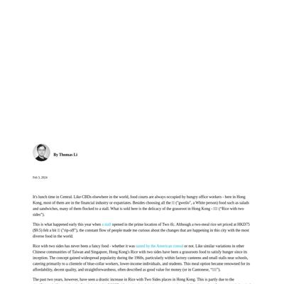
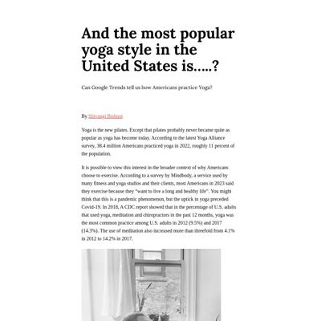

# Data Studio 2023 Personal Projects Test Page

Quick checks to make sure our pages are looking their best.

<table><tr><td>lauramiina.github.io request failed</td>
<td><a href="#thomastaoligithubio"> thomastaoli.github.io</a></td>
<td><a href="#shivangibishnoigithubio"> shivangibishnoi.github.io</a></td>
<td>sabinahung.github.io request failed</td>
</tr><tr>
<td>katrventura.github.io request failed</td>
</tr></table>

## lauramiina.github.io

|url|mobile|medium|wide|
|---|---|---|---|
|[Site not found · GitHub Pages](https://lauramiina.github.io/) :x: og:title :x: og:description :x: og:image [how to fix](https://jonathansoma.com/everything/web/social-tags/)|request failed|request failed|request failed|
|[Sauna](https://lauramiina.github.io/Suomi-Sauna/) :x: og:title :x: og:description :x: og:image [how to fix](https://jonathansoma.com/everything/web/social-tags/)||||

### Automatic Checks

**https://lauramiina.github.io/**

* **Could not access the page** - if you moved it, let me know!

**https://lauramiina.github.io/Suomi-Sauna/**

* Change URL to be all in lowercase
* Has sideways scrollbars in mobile version – check padding, margins, image widths
* 🤖 [Automatic feedback for copy edits](feedback/lauramiina.github.io/Suomi-Sauna_index.html.md)

## thomastaoli.github.io

|url|mobile|medium|wide|
|---|---|---|---|
|[Thomas Li - Home](https://thomastaoli.github.io/) :x: og:title :x: og:description :x: og:image [how to fix](https://jonathansoma.com/everything/web/social-tags/)||||
|[Data behind Hong Kong's "Rice with two sides" craze](https://thomastaoli.github.io/HK_rice_with_two_sides/story.html) :x: og:title :x: og:description :x: og:image [how to fix](https://jonathansoma.com/everything/web/social-tags/)||||

### Automatic Checks

**https://thomastaoli.github.io/**

* No issues found! 🎉

**https://thomastaoli.github.io/HK_rice_with_two_sides/story.html**

* All HTML files should be named `index.html`. If this is a personal project, move `HK_rice_with_two_sides/story.html` into a folder (or repo) called `story`, then rename the file `index.html`. That way the project can be found at **/story** instead of **/story.html**. [Read more about index.html here](https://www.thoughtco.com/index-html-page-3466505) or how it works specifically with GitHub repos [on Fancy GitHub](https://jonathansoma.com/fancy-github/github-pages/#choosing-your-url)
* Change URL to use `-` instead of spaces or underscores
* Change URL to be all in lowercase
* Datawrapper chart missing description, fill out *Alternative description for screen readers* section on Annotate tab, [tips here](https://twitter.com/FrankElavsky/status/1469023374529765385)
* 🤖 [Automatic feedback for copy edits](feedback/thomastaoli.github.io/HK_rice_with_two_sides_story.html.md)

## shivangibishnoi.github.io

|url|mobile|medium|wide|
|---|---|---|---|
|[Shivangi Bishnoi](https://shivangibishnoi.github.io) :x: og:title :x: og:description :x: og:image [how to fix](https://jonathansoma.com/everything/web/social-tags/)||||
|[Yoga story](https://shivangibishnoi.github.io/yoga-in-US/) :x: og:title :x: og:description :x: og:image [how to fix](https://jonathansoma.com/everything/web/social-tags/)||||

### Automatic Checks

**https://shivangibishnoi.github.io**

* Image(s) need `alt` tags, [info here](https://abilitynet.org.uk/news-blogs/five-golden-rules-compliant-alt-text) and [tips here](https://twitter.com/FrankElavsky/status/1469023374529765385)
    * Image `images/profile1.jpg` missing `alt` tag
    * Image `images/arrow.png` missing `alt` tag

**https://shivangibishnoi.github.io/yoga-in-US/**

* Change URL to be all in lowercase
* Has sideways scrollbars in mobile version – check padding, margins, image widths
* Image(s) need `alt` tags, [info here](https://abilitynet.org.uk/news-blogs/five-golden-rules-compliant-alt-text) and [tips here](https://twitter.com/FrankElavsky/status/1469023374529765385)
    * Image `image.jpg` missing `alt` tag
* 🤖 [Automatic feedback for copy edits](feedback/shivangibishnoi.github.io/yoga-in-US_index.html.md)

## sabinahung.github.io

|url|mobile|medium|wide|
|---|---|---|---|
|[Site not found · GitHub Pages](https://sabinahung.github.io/) :x: og:title :x: og:description :x: og:image [how to fix](https://jonathansoma.com/everything/web/social-tags/)|request failed|request failed|request failed|
|[Has Taiwan become a cat state?](https://sabinahung.github.io/pet-ownership-taiwan/) :x: og:title :x: og:description :x: og:image [how to fix](https://jonathansoma.com/everything/web/social-tags/)||||

### Automatic Checks

**https://sabinahung.github.io/**

* **Could not access the page** - if you moved it, let me know!

**https://sabinahung.github.io/pet-ownership-taiwan/**

* [Automatic feedback here](feedback/sabinahung.github.io/pet-ownership-taiwan_index.html.md)* No issues found! 🎉

## katrventura.github.io

|url|mobile|medium|wide|
|---|---|---|---|
|[Site not found · GitHub Pages](https://katrventura.github.io/) :x: og:title :x: og:description :x: og:image [how to fix](https://jonathansoma.com/everything/web/social-tags/)|request failed|request failed|request failed|
|[Data Story](https://katrventura.github.io/climate-turtle-gender/) :x: og:title :x: og:description :x: og:image [how to fix](https://jonathansoma.com/everything/web/social-tags/)||||

### Automatic Checks

**https://katrventura.github.io/**

* **Could not access the page** - if you moved it, let me know!

**https://katrventura.github.io/climate-turtle-gender/**

* [Automatic feedback here](feedback/katrventura.github.io/climate-turtle-gender_index.html.md)* No issues found! 🎉

