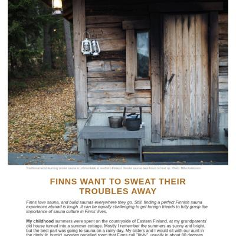
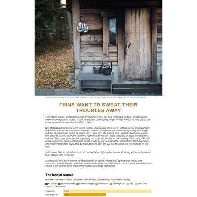

# Data Studio 2023 Personal Projects Test Page

Quick checks to make sure our pages are looking their best.

<table><tr><td>lauramiina.github.io request failed</td>
</tr></table>

## lauramiina.github.io

|url|mobile|medium|wide|
|---|---|---|---|
|[Site not found · GitHub Pages](https://lauramiina.github.io/) :x: og:title :x: og:description :x: og:image [how to fix](https://jonathansoma.com/everything/web/social-tags/)|request failed|request failed|request failed|
|[Sauna](https://lauramiina.github.io/Suomi-Sauna/) :x: og:title :x: og:description :x: og:image [how to fix](https://jonathansoma.com/everything/web/social-tags/)||||

### Automatic Checks

**https://lauramiina.github.io/**

* **Could not access the page** - if you moved it, let me know!

**https://lauramiina.github.io/Suomi-Sauna/**

* Change URL to be all in lowercase
* Has sideways scrollbars in mobile version – check padding, margins, image widths

[Automatic feedback here](feedback/lauramiina.github.io/Suomi-Sauna_index.html.md)

