# Data Studio 2024 Personal Projects Test Page

Quick checks to make sure our pages are looking their best.

<table><tr><td><a href="#charlenelin0824githubio"> charlenelin0824.github.io</a></td>
<td><a href="#dlaiugithubio"> dlaiu.github.io</a></td>
<td><a href="#juliezhngithubio"> juliezhn.github.io</a></td>
<td><a href="#katrventuragithubio"> katrventura.github.io</a></td>
</tr><tr>
<td><a href="#lauramiinagithubio"> lauramiina.github.io</a></td>
<td><a href="#mandiuugithubio"> mandiuu.github.io</a></td>
<td><a href="#meghnadbosegithubio"> meghnadbose.github.io</a></td>
<td><a href="#mjdanburygithubio">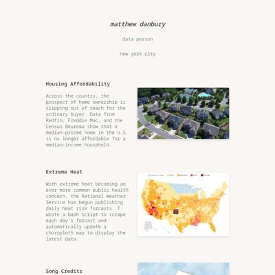 mjdanbury.github.io</a></td>
</tr><tr>
<td><a href="#ml4998githubio">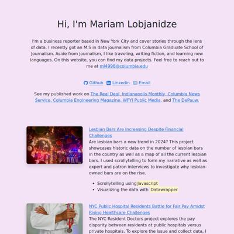 ml4998.github.io</a></td>
<td><a href="#radhika3558githubio"> radhika3558.github.io</a></td>
<td><a href="#renatadaougithubio"> renatadaou.github.io</a></td>
<td><a href="#sabinahunggithubio">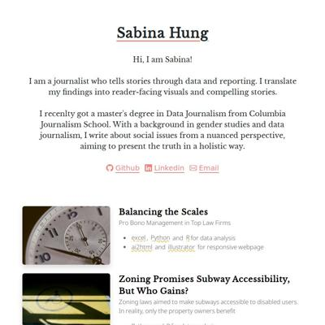 sabinahung.github.io</a></td>
</tr><tr>
<td><a href="#shivangibishnoigithubio">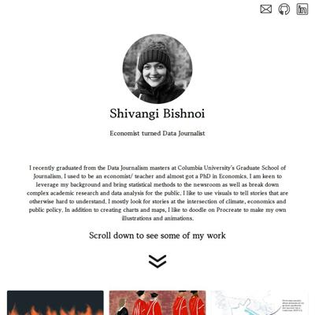 shivangibishnoi.github.io</a></td>
<td><a href="#thomastaoligithubio"> thomastaoli.github.io</a></td>
<td><a href="#yc4330githubio"> yc4330.github.io</a></td>
</tr></table>

## charlenelin0824.github.io

|url|mobile|medium|wide|
|---|---|---|---|
|[Charlene's Portfolio Website](https://charlenelin0824.github.io/) :x: og:title :x: og:description :x: og:image [how to fix](https://jonathansoma.com/everything/web/social-tags/)||||
|[BBC Film Project](https://charlenelin0824.github.io/BBC-film-project/) :x: og:title :x: og:description :x: og:image [how to fix](https://jonathansoma.com/everything/web/social-tags/)|||[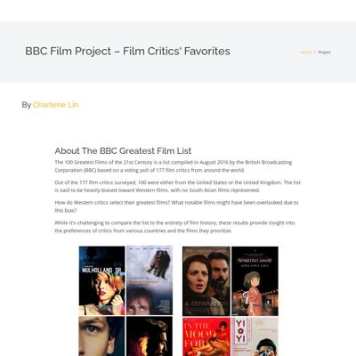](screenshots/charlenelin0824.github.io/BBC-film-project_index.html-wide-full.jpg)|
|[Deadly Sweet – Sugar in American Diet Compared Internationally](https://charlenelin0824.github.io/deadly-sweet/) :x: og:title :x: og:description :x: og:image [how to fix](https://jonathansoma.com/everything/web/social-tags/)||||
|[Feast for the Senses: Taiwan's Thriving Buffet Restaurant Scene](https://charlenelin0824.github.io/fancy-buffet/) :x: og:title :x: og:description :x: og:image [how to fix](https://jonathansoma.com/everything/web/social-tags/)|[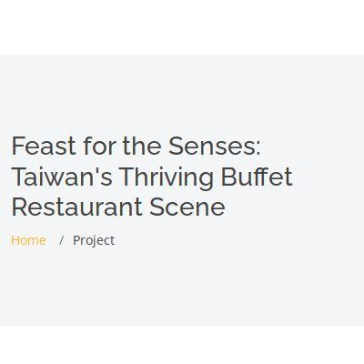](screenshots/charlenelin0824.github.io/fancy-buffet_index.html-mobile-full.jpg)|[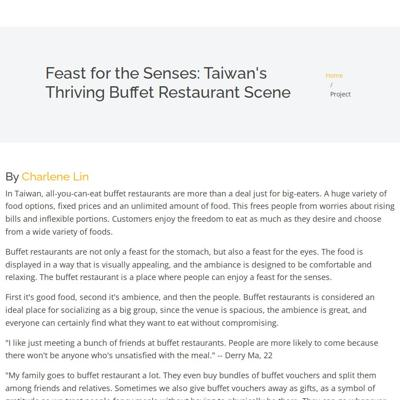](screenshots/charlenelin0824.github.io/fancy-buffet_index.html-medium-full.jpg)||

### Automatic Checks

**https://charlenelin0824.github.io/**

* Has sideways scrollbars in mobile version – check padding, margins, image widths

**https://charlenelin0824.github.io/BBC-film-project/**

* Change URL to be all in lowercase
* Has sideways scrollbars in mobile version – check padding, margins, image widths
* 🤖 [Automatic feedback for copy edits](feedback/charlenelin0824.github.io/BBC-film-project_index.html.md)

**https://charlenelin0824.github.io/deadly-sweet/**

* Has sideways scrollbars in mobile version – check padding, margins, image widths
* 🤖 [Automatic feedback for copy edits](feedback/charlenelin0824.github.io/deadly-sweet_index.html.md)

**https://charlenelin0824.github.io/fancy-buffet/**

* 🤖 [Automatic feedback here](feedback/charlenelin0824.github.io/fancy-buffet_index.html.md)
* No issues found! 🎉

## dlaiu.github.io

|url|mobile|medium|wide|
|---|---|---|---|
|[index.html](https://dlaiu.github.io/) :x: og:title :x: og:description :x: og:image [how to fix](https://jonathansoma.com/everything/web/social-tags/)|[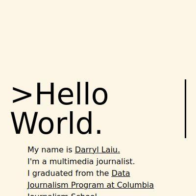](screenshots/dlaiu.github.io/index.html-mobile-full.jpg)|||
|[data-stories/ign-game-reviews/index.html](https://dlaiu.github.io/data-stories/ign-game-reviews) :x: og:title :x: og:description :x: og:image [how to fix](https://jonathansoma.com/everything/web/social-tags/)|request failed|request failed|request failed|
|[Why do all malls in Singapore feel the same?](https://dlaiu.github.io/generic-malls-singapore/) :x: og:title :x: og:description :x: og:image [how to fix](https://jonathansoma.com/everything/web/social-tags/)|[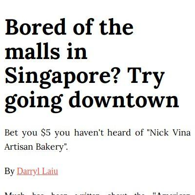](screenshots/dlaiu.github.io/generic-malls-singapore_index.html-mobile-full.jpg)||[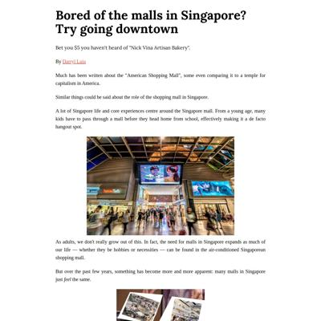](screenshots/dlaiu.github.io/generic-malls-singapore_index.html-wide-full.jpg)|
|[When was the best SNL era, objectively](https://dlaiu.github.io/snl-dream-team/) :x: og:title :x: og:description :x: og:image [how to fix](https://jonathansoma.com/everything/web/social-tags/)||[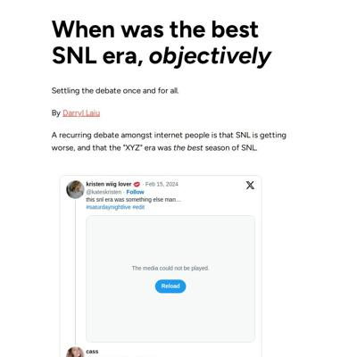](screenshots/dlaiu.github.io/snl-dream-team_index.html-medium-full.jpg)|[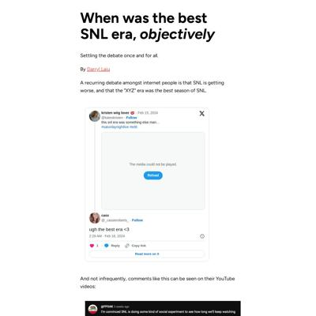](screenshots/dlaiu.github.io/snl-dream-team_index.html-wide-full.jpg)|

### Automatic Checks

**https://dlaiu.github.io/**

* Needs a title, add a `<title>` tag to the `<head>`

**https://dlaiu.github.io/data-stories/ign-game-reviews**

* **Could not access the page** - if you moved it, [let me know](https://github.com/jsoma/data-studio-projects-2024/issues/new/choose)!
* 🤖 [Automatic feedback for copy edits](feedback/dlaiu.github.io/data-stories_ign-game-reviews_index.html.md)

**https://dlaiu.github.io/generic-malls-singapore/**

* 🤖 [Automatic feedback here](feedback/dlaiu.github.io/generic-malls-singapore_index.html.md)
* No issues found! 🎉

**https://dlaiu.github.io/snl-dream-team/**

* Has sideways scrollbars in mobile version – check padding, margins, image widths
* 🤖 [Automatic feedback for copy edits](feedback/dlaiu.github.io/snl-dream-team_index.html.md)

## juliezhn.github.io

|url|mobile|medium|wide|
|---|---|---|---|
|[Julie Zhu's Portfolio](https://juliezhn.github.io/) :x: og:title :x: og:description :x: og:image [how to fix](https://jonathansoma.com/everything/web/social-tags/)||||
|[Story template](https://juliezhn.github.io/food-delivery/) :x: og:title :x: og:description :x: og:image [how to fix](https://jonathansoma.com/everything/web/social-tags/)|||[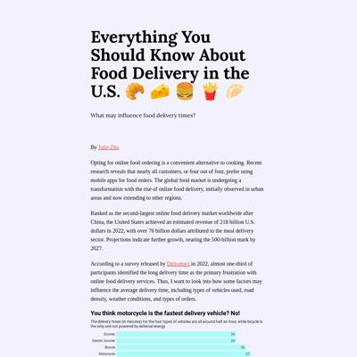](screenshots/juliezhn.github.io/food-delivery_index.html-wide-full.jpg)|
|[Is Julie an outedated name?](https://juliezhn.github.io/julie-name/) :x: og:title :x: og:description :x: og:image [how to fix](https://jonathansoma.com/everything/web/social-tags/)||[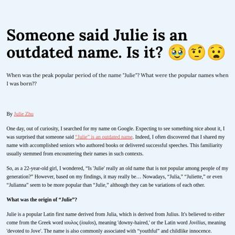](screenshots/juliezhn.github.io/julie-name_index.html-medium-full.jpg)|[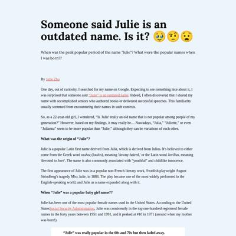](screenshots/juliezhn.github.io/julie-name_index.html-wide-full.jpg)|
|[Story template](https://juliezhn.github.io/nyc-dropout-rate/) :x: og:title :x: og:description :x: og:image [how to fix](https://jonathansoma.com/everything/web/social-tags/)||||

### Automatic Checks

**https://juliezhn.github.io/**

* No issues found! 🎉

**https://juliezhn.github.io/food-delivery/**

* Image(s) need `alt` tags, [info here](https://abilitynet.org.uk/news-blogs/five-golden-rules-compliant-alt-text) and [tips here](https://twitter.com/FrankElavsky/status/1469023374529765385)
    * Image `project1_delivery_image.jpeg` missing `alt` tag
* 🤖 [Automatic feedback for copy edits](feedback/juliezhn.github.io/food-delivery_index.html.md)

**https://juliezhn.github.io/julie-name/**

* Minimum font size should be 12px, enlarge text in CSS or Illustrator
    * Text `200,000 babies` is too small at 10px
    * Text `200,000 babies` is too small at 10px
    * Text `0` is too small at 10px
    * Text `100,000` is too small at 10px
    * Text `0` is too small at 10px
    * Text `100,000` is too small at 10px
    * Text `0` is too small at 9px
    * *and 9 more*
* 🤖 [Automatic feedback for copy edits](feedback/juliezhn.github.io/julie-name_index.html.md)

**https://juliezhn.github.io/nyc-dropout-rate/**

* 🤖 [Automatic feedback here](feedback/juliezhn.github.io/nyc-dropout-rate_index.html.md)
* No issues found! 🎉

## katrventura.github.io

|url|mobile|medium|wide|
|---|---|---|---|
|[Katrina Ventura Portfolio](https://katrventura.github.io/)|[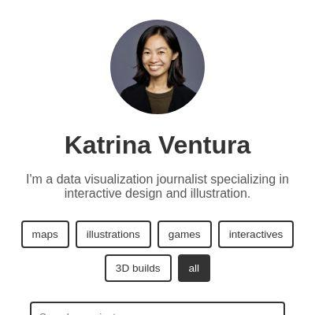](screenshots/katrventura.github.io/index.html-mobile-full.jpg)|||
|[Feminine Waves](https://katrventura.github.io/climate-turtle-gender/)||||
|[2024 Elections](https://katrventura.github.io/elections-scraper/)|||[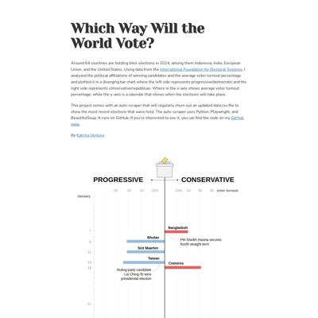](screenshots/katrventura.github.io/elections-scraper_index.html-wide-full.jpg)|
|[Cutting Orchids](https://katrventura.github.io/fgm-orchids/)||||

### Automatic Checks

**https://katrventura.github.io/**

* No issues found! 🎉

**https://katrventura.github.io/climate-turtle-gender/**

* 🤖 [Automatic feedback here](feedback/katrventura.github.io/climate-turtle-gender_index.html.md)
* No issues found! 🎉

**https://katrventura.github.io/elections-scraper/**

* Minimum font size should be 12px, enlarge text in CSS or Illustrator
    * Text `PROGRESSIVE` is too small at 10px
    * Text `CONSERVATIVE` is too small at 10px
    * Text `voter turnout` is too small at 8px
    * Text `60` is too small at 6px
    * Text `40` is too small at 6px
    * Text `20%` is too small at 6px
    * Text `20%` is too small at 6px
    * *and 131 more*
* 🤖 [Automatic feedback for copy edits](feedback/katrventura.github.io/elections-scraper_index.html.md)

**https://katrventura.github.io/fgm-orchids/**

* Minimum font size should be 12px, enlarge text in CSS or Illustrator
    * Text `TYPE 1` is too small at 10px
    * Text `Partial or total removal of` is too small at 10px
    * Text `clitoral glans` is too small at 10px
    * Text `TYPE 2` is too small at 10px
    * Text ` ` is too small at 10px
    * Text `Partial or total removal of ` is too small at 10px
    * Text `clitoral glans and labia ` is too small at 10px
    * *and 64 more*
* 🤖 [Automatic feedback for copy edits](feedback/katrventura.github.io/fgm-orchids_index.html.md)

## lauramiina.github.io

|url|mobile|medium|wide|
|---|---|---|---|
|[Laura Kukkonen](https://lauramiina.github.io/)||||
|[ASMR](https://lauramiina.github.io/asmr-project/)||||
|[Forest](https://lauramiina.github.io/nybg-forest/)|[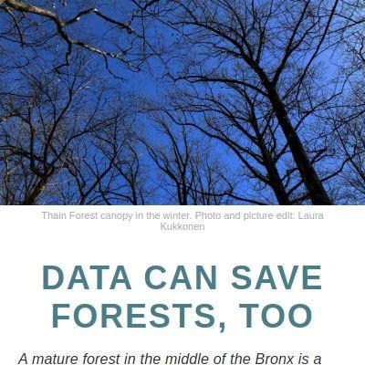](screenshots/lauramiina.github.io/nybg-forest_index.html-mobile-full.jpg)|||
|[Sauna](https://lauramiina.github.io/suomi-sauna/) :x: og:title :x: og:description :x: og:image [how to fix](https://jonathansoma.com/everything/web/social-tags/)|[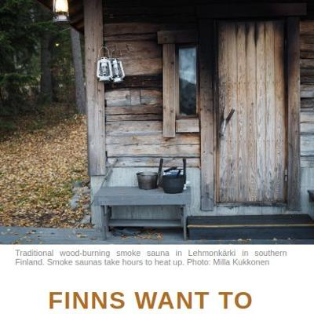](screenshots/lauramiina.github.io/suomi-sauna_index.html-mobile-full.jpg)|||

### Automatic Checks

**https://lauramiina.github.io/**

* Has sideways scrollbars in mobile version – check padding, margins, image widths

**https://lauramiina.github.io/asmr-project/**

* 🤖 [Automatic feedback here](feedback/lauramiina.github.io/asmr-project_index.html.md)
* No issues found! 🎉

**https://lauramiina.github.io/nybg-forest/**

* Minimum font size should be 12px, enlarge text in CSS or Illustrator
    * Text `Oaks` is too small at 9px
    * Text `Eastern hemlock` is too small at 9px
    * Text `30 %` is too small at 10px
    * Text `Eastern hemlock` is too small at 8px
    * Text `Share of count` is too small at 8px
    * Text `Share of plant area` is too small at 8px
    * Text `Oaks` is too small at 8px
    * *and 52 more*
* 🤖 [Automatic feedback for copy edits](feedback/lauramiina.github.io/nybg-forest_index.html.md)

**https://lauramiina.github.io/suomi-sauna/**

* Has sideways scrollbars in mobile version – check padding, margins, image widths
* 🤖 [Automatic feedback for copy edits](feedback/lauramiina.github.io/suomi-sauna_index.html.md)

## mandiuu.github.io

|url|mobile|medium|wide|
|---|---|---|---|
|[Carla Mandiola Website](https://mandiuu.github.io/) :x: og:title :x: og:description :x: og:image [how to fix](https://jonathansoma.com/everything/web/social-tags/)||||
|[Wine in NYC](https://mandiuu.github.io/wine) :x: og:title :x: og:description :x: og:image [how to fix](https://jonathansoma.com/everything/web/social-tags/)||[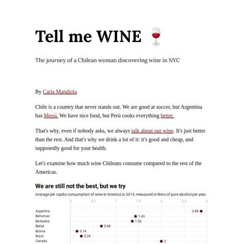](screenshots/mandiuu.github.io/wine_index.html-medium-full.jpg)||
|[✨All that glitters is not gold: the downfall of trying to use NY Data✨](https://mandiuu.github.io/baby/)||||
|[Where is your bike in the city?](https://mandiuu.github.io/Citi_Bike/) :x: og:image [how to fix](https://jonathansoma.com/everything/web/social-tags/)|[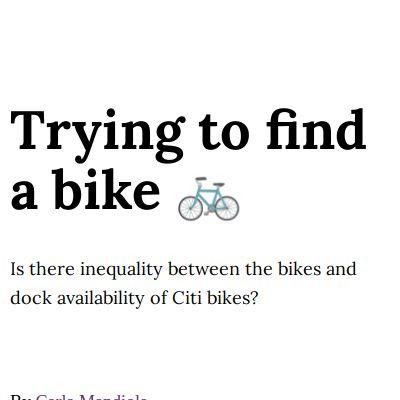](screenshots/mandiuu.github.io/Citi_Bike_index.html-mobile-full.jpg)|||

### Automatic Checks

**https://mandiuu.github.io/**

* Missing viewport meta tag in `<head>`, needed to tell browser it's responsive. Add `<meta name="viewport" content="width=device-width, initial-scale=1, shrink-to-fit=no">`

**https://mandiuu.github.io/wine**

* Image(s) need `alt` tags, [info here](https://abilitynet.org.uk/news-blogs/five-golden-rules-compliant-alt-text) and [tips here](https://twitter.com/FrankElavsky/status/1469023374529765385)
    * Image `GFajZOEXgAAXHJZ.jpeg` missing `alt` tag
    * Image `prices.png` missing `alt` tag
* 🤖 [Automatic feedback for copy edits](feedback/mandiuu.github.io/wine_index.html.md)

**https://mandiuu.github.io/baby/**

* 🤖 [Automatic feedback here](feedback/mandiuu.github.io/baby_index.html.md)
* No issues found! 🎉

**https://mandiuu.github.io/Citi_Bike/**

* Change URL to use `-` instead of spaces or underscores
* Change URL to be all in lowercase
* Minimum font size should be 12px, enlarge text in CSS or Illustrator
    * Text `No bikes here` is too small at 9px
    * Text `Bronx` is too small at 9px
    * Text `Manhattan` is too small at 9px
    * Text `Queens` is too small at 9px
    * Text `No bikes here either` is too small at 9px
    * Text `Brooklyn` is too small at 9px
    * Text `Or here` is too small at 9px
    * *and 4 more*
* 🤖 [Automatic feedback for copy edits](feedback/mandiuu.github.io/Citi_Bike_index.html.md)

## meghnadbose.github.io

|url|mobile|medium|wide|
|---|---|---|---|
|[Meghnad Bose  Award-winning multimedia journalist](https://meghnadbose.github.io/)||||
|[In Election Year, Religious Issues and Opposition-Bashing Dominate Primetime TV News in India](https://meghnadbose.github.io/indian-tv-media-coverage-analysis/)||||
|[We Ranked the Purple States of the 2024 US Presidential Election. Here Are The Swingiest States of Them All](https://meghnadbose.github.io/purple-states-us-presidential-election/)||||
|[More Results, Closer Matches in Tests Now: But Will That Be Enough to Save Cricket’s 5-Day Format?](https://meghnadbose.github.io/test-cricket)|[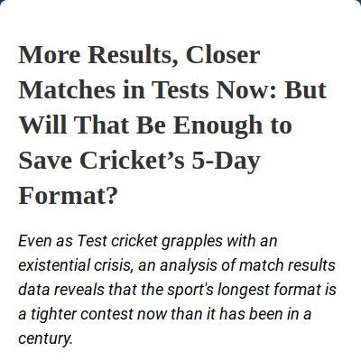](screenshots/meghnadbose.github.io/test-cricket_index.html-mobile-full.jpg)|[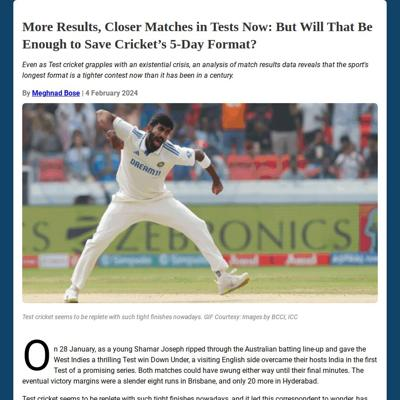](screenshots/meghnadbose.github.io/test-cricket_index.html-medium-full.jpg)|[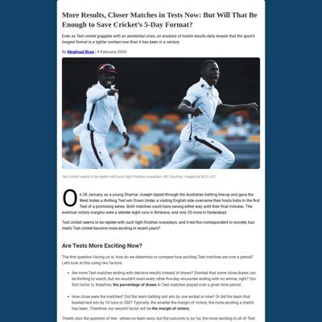](screenshots/meghnadbose.github.io/test-cricket_index.html-wide-full.jpg)|

### Automatic Checks

**https://meghnadbose.github.io/**

* No issues found! 🎉

**https://meghnadbose.github.io/indian-tv-media-coverage-analysis/**

* 🤖 [Automatic feedback here](feedback/meghnadbose.github.io/indian-tv-media-coverage-analysis_index.html.md)
* No issues found! 🎉

**https://meghnadbose.github.io/purple-states-us-presidential-election/**

* Minimum font size should be 12px, enlarge text in CSS or Illustrator
    * Text `Won by Biden in 2020` is too small at 10px
    * Text `Won by Trump in 2020` is too small at 10px
    * Text `North Dakota` is too small at 9px
    * Text `Pennsylvania` is too small at 9px
    * Text `Wisconsin` is too small at 9px
    * Text `Michigan` is too small at 9px
    * Text `Tennessee` is too small at 9px
    * *and 3 more*
* 🤖 [Automatic feedback for copy edits](feedback/meghnadbose.github.io/purple-states-us-presidential-election_index.html.md)

**https://meghnadbose.github.io/test-cricket**

* Has sideways scrollbars in mobile version – check padding, margins, image widths
* 🤖 [Automatic feedback for copy edits](feedback/meghnadbose.github.io/test-cricket_index.html.md)

## mjdanbury.github.io

|url|mobile|medium|wide|
|---|---|---|---|
|[Matthew Danbury](https://mjdanbury.github.io/) :x: og:title :x: og:description :x: og:image [how to fix](https://jonathansoma.com/everything/web/social-tags/)|[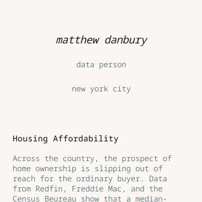](screenshots/mjdanbury.github.io/index.html-mobile-full.jpg)||[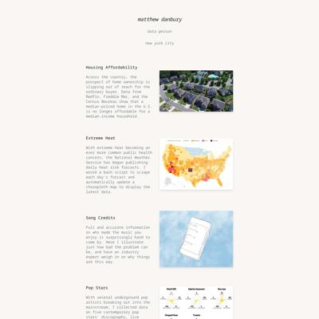](screenshots/mjdanbury.github.io/index.html-wide-full.jpg)|
|[Ingredient Households Have It Better](https://mjdanbury.github.io/food-recalls/) :x: og:title :x: og:description :x: og:image [how to fix](https://jonathansoma.com/everything/web/social-tags/)|[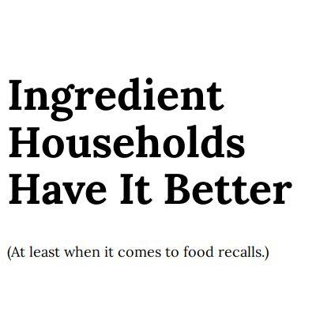](screenshots/mjdanbury.github.io/food-recalls_index.html-mobile-full.jpg)|[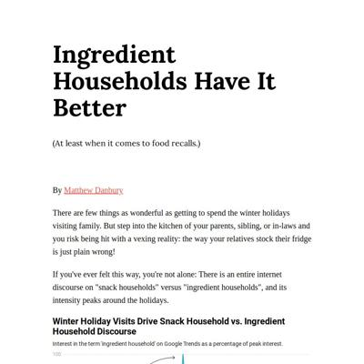](screenshots/mjdanbury.github.io/food-recalls_index.html-medium-full.jpg)||
|[Upended](https://mjdanbury.github.io/pandemic-changes-311/) :x: og:title :x: og:description :x: og:image [how to fix](https://jonathansoma.com/everything/web/social-tags/)|||[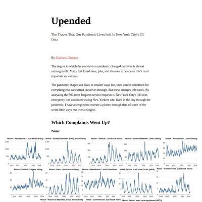](screenshots/mjdanbury.github.io/pandemic-changes-311_index.html-wide-full.jpg)|
|[What Makes For A Great Pizza Crust?](https://mjdanbury.github.io/PIZZA-PIZZA/) :x: og:title :x: og:description :x: og:image [how to fix](https://jonathansoma.com/everything/web/social-tags/)|||[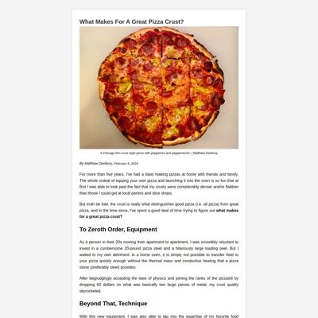](screenshots/mjdanbury.github.io/PIZZA-PIZZA_index.html-wide-full.jpg)|

### Automatic Checks

**https://mjdanbury.github.io/**

* No issues found! 🎉

**https://mjdanbury.github.io/food-recalls/**

* Has sideways scrollbars in mobile version – check padding, margins, image widths
* 🤖 [Automatic feedback for copy edits](feedback/mjdanbury.github.io/food-recalls_index.html.md)

**https://mjdanbury.github.io/pandemic-changes-311/**

* Image(s) need `alt` tags, [info here](https://abilitynet.org.uk/news-blogs/five-golden-rules-compliant-alt-text) and [tips here](https://twitter.com/FrankElavsky/status/1469023374529765385)
    * Image `charts-up/0.svg` missing `alt` tag
    * Image `charts-up/4.svg` missing `alt` tag
    * Image `charts-up/18.svg` missing `alt` tag
    * Image `charts-up/23.svg` missing `alt` tag
    * Image `charts-up/35.svg` missing `alt` tag
    * *and 59 more*
* 🤖 [Automatic feedback for copy edits](feedback/mjdanbury.github.io/pandemic-changes-311_index.html.md)

**https://mjdanbury.github.io/PIZZA-PIZZA/**

* Change URL to be all in lowercase
* Has sideways scrollbars in mobile version – check padding, margins, image widths
* 🤖 [Automatic feedback for copy edits](feedback/mjdanbury.github.io/PIZZA-PIZZA_index.html.md)

## ml4998.github.io

|url|mobile|medium|wide|
|---|---|---|---|
|[Mariam Lobjanidze](https://ml4998.github.io/)||||
|[Story template](https://ml4998.github.io/MOMA/) :x: og:title :x: og:description :x: og:image [how to fix](https://jonathansoma.com/everything/web/social-tags/)||||
|[Story template](https://ml4998.github.io/nycresidents/) :x: og:title :x: og:description :x: og:image [how to fix](https://jonathansoma.com/everything/web/social-tags/)||||
|[Story template](https://ml4998.github.io/Pizza-styles/) :x: og:title :x: og:description :x: og:image [how to fix](https://jonathansoma.com/everything/web/social-tags/)||[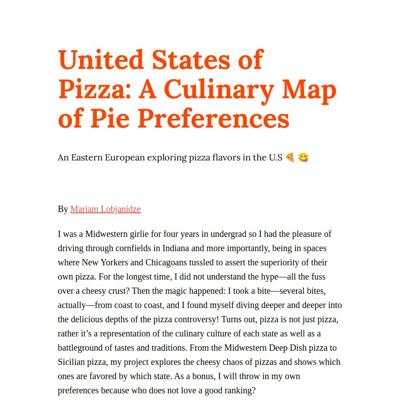](screenshots/ml4998.github.io/Pizza-styles_index.html-medium-full.jpg)||

### Automatic Checks

**https://ml4998.github.io/**

* No issues found! 🎉

**https://ml4998.github.io/MOMA/**

* Change URL to be all in lowercase
* Image(s) need `alt` tags, [info here](https://abilitynet.org.uk/news-blogs/five-golden-rules-compliant-alt-text) and [tips here](https://twitter.com/FrankElavsky/status/1469023374529765385)
    * Image `6.jpg` missing `alt` tag
    * Image `artistsbycont.png` missing `alt` tag
    * Image `artistsbygender.png` missing `alt` tag
    * Image `4.jpg` missing `alt` tag
* 🤖 [Automatic feedback for copy edits](feedback/ml4998.github.io/MOMA_index.html.md)

**https://ml4998.github.io/nycresidents/**

* Image(s) need `alt` tags, [info here](https://abilitynet.org.uk/news-blogs/five-golden-rules-compliant-alt-text) and [tips here](https://twitter.com/FrankElavsky/status/1469023374529765385)
    * Image `chartone.png` missing `alt` tag
    * Image `charttwo.png` missing `alt` tag
* 🤖 [Automatic feedback for copy edits](feedback/ml4998.github.io/nycresidents_index.html.md)

**https://ml4998.github.io/Pizza-styles/**

* Change URL to be all in lowercase
* Image(s) need `alt` tags, [info here](https://abilitynet.org.uk/news-blogs/five-golden-rules-compliant-alt-text) and [tips here](https://twitter.com/FrankElavsky/status/1469023374529765385)
    * Image `sicillian.jpg` missing `alt` tag
    * Image `deepdish.jpg` missing `alt` tag
    * Image `supreme.jpg` missing `alt` tag
    * Image `chart.png` missing `alt` tag
* 🤖 [Automatic feedback for copy edits](feedback/ml4998.github.io/Pizza-styles_index.html.md)

## radhika3558.github.io

|url|mobile|medium|wide|
|---|---|---|---|
|[Radhika Rukmangadhan](https://radhika3558.github.io/)|[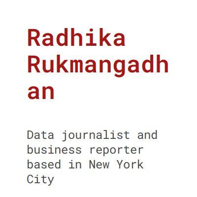](screenshots/radhika3558.github.io/index.html-mobile-full.jpg)||[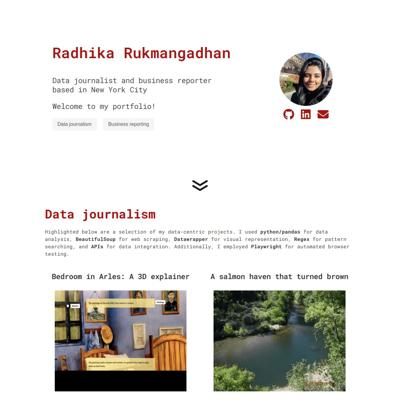](screenshots/radhika3558.github.io/index.html-wide-full.jpg)|
|[Cash Crunch](https://radhika3558.github.io/cash-circulation/)||||
|[Sticker shock: Prescription drug prices in the US vs the world](https://radhika3558.github.io/pharma-prices/)||||
|[Rainy Weekends](https://radhika3558.github.io/rainy-weekends/)|||[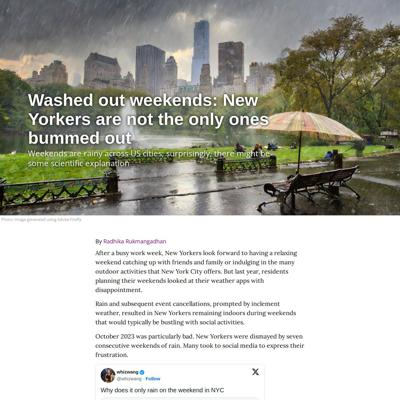](screenshots/radhika3558.github.io/rainy-weekends_index.html-wide-full.jpg)|

### Automatic Checks

**https://radhika3558.github.io/**

* No issues found! 🎉

**https://radhika3558.github.io/cash-circulation/**

* Has sideways scrollbars in mobile version – check padding, margins, image widths
* 🤖 [Automatic feedback for copy edits](feedback/radhika3558.github.io/cash-circulation_index.html.md)

**https://radhika3558.github.io/pharma-prices/**

* 🤖 [Automatic feedback here](feedback/radhika3558.github.io/pharma-prices_index.html.md)
* No issues found! 🎉

**https://radhika3558.github.io/rainy-weekends/**

* Has sideways scrollbars in mobile version – check padding, margins, image widths
* 🤖 [Automatic feedback for copy edits](feedback/radhika3558.github.io/rainy-weekends_index.html.md)

## renatadaou.github.io

|url|mobile|medium|wide|
|---|---|---|---|
|[Renata Carlos Daou - Github](https://renatadaou.github.io/)||||
|[Syrian Refugees](https://renatadaou.github.io/migration)|[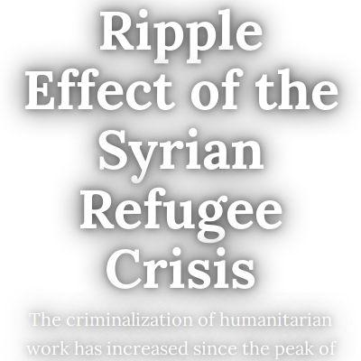](screenshots/renatadaou.github.io/migration_index.html-mobile-full.jpg)|[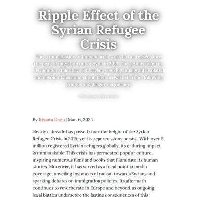](screenshots/renatadaou.github.io/migration_index.html-medium-full.jpg)|[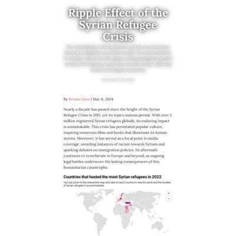](screenshots/renatadaou.github.io/migration_index.html-wide-full.jpg)|
|[Page not found · GitHub Pages](https://renatadaou.github.io/SoulCycle-vs-CycleBar/) :x: og:title :x: og:description :x: og:image [how to fix](https://jonathansoma.com/everything/web/social-tags/)|request failed|request failed|request failed|
|[Page not found · GitHub Pages](https://renatadaou.github.io/Wildfires-in-Amazonas-2023/) :x: og:title :x: og:description :x: og:image [how to fix](https://jonathansoma.com/everything/web/social-tags/)|request failed|request failed|request failed|

### Automatic Checks

**https://renatadaou.github.io/**

* No issues found! 🎉

**https://renatadaou.github.io/migration**

* Minimum font size should be 12px, enlarge text in CSS or Illustrator
    * Text `Malta` is too small at 10px
* 🤖 [Automatic feedback for copy edits](feedback/renatadaou.github.io/migration_index.html.md)

**https://renatadaou.github.io/SoulCycle-vs-CycleBar/**

* **Could not access the page** - if you moved it, [let me know](https://github.com/jsoma/data-studio-projects-2024/issues/new/choose)!
* 🤖 [Automatic feedback for copy edits](feedback/renatadaou.github.io/SoulCycle-vs-CycleBar_index.html.md)

**https://renatadaou.github.io/Wildfires-in-Amazonas-2023/**

* **Could not access the page** - if you moved it, [let me know](https://github.com/jsoma/data-studio-projects-2024/issues/new/choose)!
* 🤖 [Automatic feedback for copy edits](feedback/renatadaou.github.io/Wildfires-in-Amazonas-2023_index.html.md)

## sabinahung.github.io

|url|mobile|medium|wide|
|---|---|---|---|
|[Sabina Hung](https://sabinahung.github.io/)|[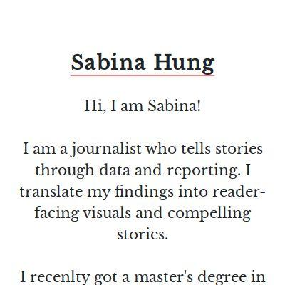](screenshots/sabinahung.github.io/index.html-mobile-full.jpg)||[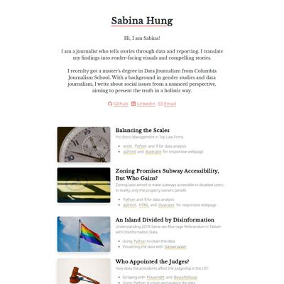](screenshots/sabinahung.github.io/index.html-wide-full.jpg)|
|[Dumpster Dive for the environment](https://sabinahung.github.io/dumpster-dive/)||[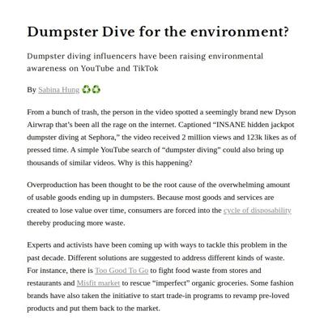](screenshots/sabinahung.github.io/dumpster-dive_index.html-medium-full.jpg)|[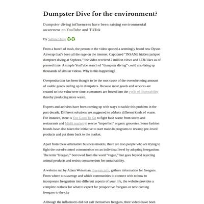](screenshots/sabinahung.github.io/dumpster-dive_index.html-wide-full.jpg)|
|[An Island Divided by Disinformation](https://sabinahung.github.io/gay-marriage-disinformation/)||||
|[Has Taiwan become a cat state?](https://sabinahung.github.io/pet-ownership-taiwan/)||[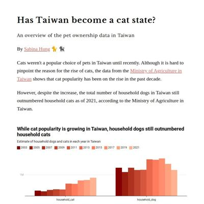](screenshots/sabinahung.github.io/pet-ownership-taiwan_index.html-medium-full.jpg)|[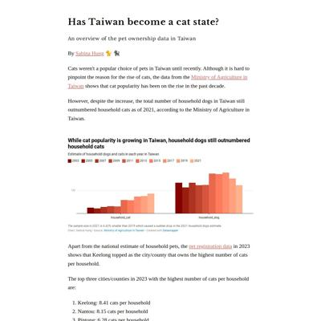](screenshots/sabinahung.github.io/pet-ownership-taiwan_index.html-wide-full.jpg)|

### Automatic Checks

**https://sabinahung.github.io/**

* No issues found! 🎉

**https://sabinahung.github.io/dumpster-dive/**

* Minimum font size should be 12px, enlarge text in CSS or Illustrator
    * Text `141` is too small at 10px
    * Text `2023` is too small at 9px
    * Text `2022` is too small at 9px
    * Text `2021` is too small at 9px
    * Text `2020` is too small at 9px
    * Text `2019` is too small at 9px
    * Text `2018` is too small at 9px
    * *and 11 more*
* 🤖 [Automatic feedback for copy edits](feedback/sabinahung.github.io/dumpster-dive_index.html.md)

**https://sabinahung.github.io/gay-marriage-disinformation/**

* 🤖 [Automatic feedback here](feedback/sabinahung.github.io/gay-marriage-disinformation_index.html.md)
* No issues found! 🎉

**https://sabinahung.github.io/pet-ownership-taiwan/**

* 🤖 [Automatic feedback here](feedback/sabinahung.github.io/pet-ownership-taiwan_index.html.md)
* No issues found! 🎉

## shivangibishnoi.github.io

|url|mobile|medium|wide|
|---|---|---|---|
|[Shivangi Bishnoi](https://shivangibishnoi.github.io) :x: og:title :x: og:description :x: og:image [how to fix](https://jonathansoma.com/everything/web/social-tags/)|[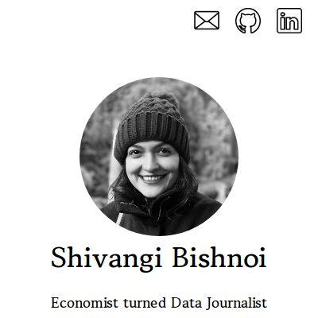](screenshots/shivangibishnoi.github.io/index.html-mobile-full.jpg)|||
|[Aerosole Debate](https://shivangibishnoi.github.io/aerosols-and-clouds/)||[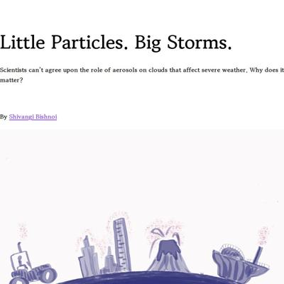](screenshots/shivangibishnoi.github.io/aerosols-and-clouds_index.html-medium-full.jpg)|[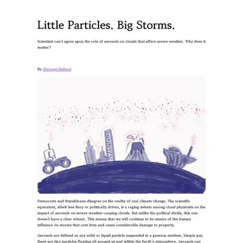](screenshots/shivangibishnoi.github.io/aerosols-and-clouds_index.html-wide-full.jpg)|
|[Flood Insurance](https://shivangibishnoi.github.io/flood-insurance/index.html)|||[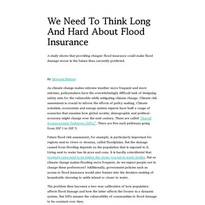](screenshots/shivangibishnoi.github.io/flood-insurance_index.html-wide-full.jpg)|
|[Yoga story](https://shivangibishnoi.github.io/yoga-in-us/)||||

### Automatic Checks

**https://shivangibishnoi.github.io**

* No issues found! 🎉

**https://shivangibishnoi.github.io/aerosols-and-clouds/**

* Has sideways scrollbars in mobile version – check padding, margins, image widths
* 🤖 [Automatic feedback for copy edits](feedback/shivangibishnoi.github.io/aerosols-and-clouds_index.html.md)

**https://shivangibishnoi.github.io/flood-insurance/index.html**

* Minimum font size should be 12px, enlarge text in CSS or Illustrator
    * Text `+50%` is too small at 8px
    * Text `0%` is too small at 8px
    * Text `-+10%` is too small at 8px
    * Text `+50%` is too small at 8px
    * Text `0%` is too small at 8px
    * Text `-+10%` is too small at 8px
    * Text `0.5x` is too small at 9px
    * *and 49 more*
* 🤖 [Automatic feedback for copy edits](feedback/shivangibishnoi.github.io/flood-insurance_index.html.md)

**https://shivangibishnoi.github.io/yoga-in-us/**

* 🤖 [Automatic feedback here](feedback/shivangibishnoi.github.io/yoga-in-us_index.html.md)
* No issues found! 🎉

## thomastaoli.github.io

|url|mobile|medium|wide|
|---|---|---|---|
|[Thomas Li - Home](https://thomastaoli.github.io/) :x: og:title :x: og:description :x: og:image [how to fix](https://jonathansoma.com/everything/web/social-tags/)||||
|[Why the Year of Dragon brings baby boom?](https://thomastaoli.github.io/dragon-baby/)||||
|[Data behind Hong Kong's "Rice with two sides" craze](https://thomastaoli.github.io/hk-rice-with-two-sides/) :x: og:title :x: og:description :x: og:image [how to fix](https://jonathansoma.com/everything/web/social-tags/)||||
|[Food Desert in New York City](https://thomastaoli.github.io/ny-food-desert/)||[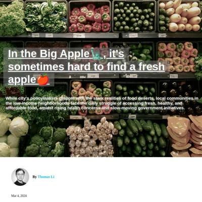](screenshots/thomastaoli.github.io/ny-food-desert_index.html-medium-full.jpg)||

### Automatic Checks

**https://thomastaoli.github.io/**

* No issues found! 🎉

**https://thomastaoli.github.io/dragon-baby/**

* 🤖 [Automatic feedback here](feedback/thomastaoli.github.io/dragon-baby_index.html.md)
* No issues found! 🎉

**https://thomastaoli.github.io/hk-rice-with-two-sides/**

* 🤖 [Automatic feedback here](feedback/thomastaoli.github.io/hk-rice-with-two-sides_index.html.md)
* No issues found! 🎉

**https://thomastaoli.github.io/ny-food-desert/**

* Minimum font size should be 12px, enlarge text in CSS or Illustrator
    * Text `Number of selected* grocery stores with fresh food supply in the neighborhood` is too small at 10px
    * Text `Staten Island` is too small at 10px
* 🤖 [Automatic feedback for copy edits](feedback/thomastaoli.github.io/ny-food-desert_index.html.md)

## yc4330.github.io

|url|mobile|medium|wide|
|---|---|---|---|
|[Portfolio of Yuqi Cheng](https://yc4330.github.io/) :x: og:title :x: og:description :x: og:image [how to fix](https://jonathansoma.com/everything/web/social-tags/)||||
|[311 firework complaints](https://yc4330.github.io/311-firework/) :x: og:title :x: og:description :x: og:image [how to fix](https://jonathansoma.com/everything/web/social-tags/)||||
|[Missing Girls in the Third Child](https://yc4330.github.io/gender-ratio-in-china/) :x: og:title :x: og:description :x: og:image [how to fix](https://jonathansoma.com/everything/web/social-tags/)|[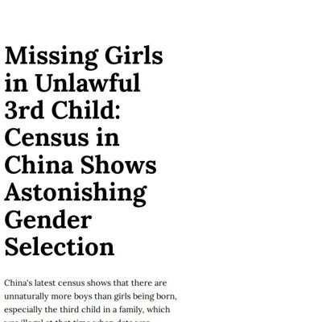](screenshots/yc4330.github.io/gender-ratio-in-china_index.html-mobile-full.jpg)|||
|[Kumquat, a new luxurious fruit](https://yc4330.github.io/kumquat-rongan/) :x: og:title :x: og:description :x: og:image [how to fix](https://jonathansoma.com/everything/web/social-tags/)|||[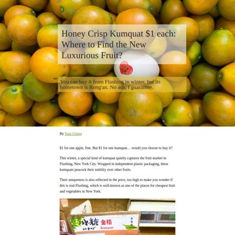](screenshots/yc4330.github.io/kumquat-rongan_index.html-wide-full.jpg)|

### Automatic Checks

**https://yc4330.github.io/**

* No issues found! 🎉

**https://yc4330.github.io/311-firework/**

* Add a link to your project's GitHub repo, so people can review your code
* 🤖 [Automatic feedback for copy edits](feedback/yc4330.github.io/311-firework_index.html.md)

**https://yc4330.github.io/gender-ratio-in-china/**

* Has sideways scrollbars in mobile version – check padding, margins, image widths
* Image(s) need `alt` tags, [info here](https://abilitynet.org.uk/news-blogs/five-golden-rules-compliant-alt-text) and [tips here](https://twitter.com/FrankElavsky/status/1469023374529765385)
    * Image `doc/child-policy.jpg` missing `alt` tag
    * Image `doc/pic.jpg` missing `alt` tag
* 🤖 [Automatic feedback for copy edits](feedback/yc4330.github.io/gender-ratio-in-china_index.html.md)

**https://yc4330.github.io/kumquat-rongan/**

* Image(s) need `alt` tags, [info here](https://abilitynet.org.uk/news-blogs/five-golden-rules-compliant-alt-text) and [tips here](https://twitter.com/FrankElavsky/status/1469023374529765385)
    * Image `doc/flushing.jpg` missing `alt` tag
    * Image `doc/price.png` missing `alt` tag
    * Image `doc/size.jpg` missing `alt` tag
    * Image `doc/brix_pic.jpg` missing `alt` tag
    * Image `doc/brix.jpg` missing `alt` tag
    * *and 1 more*
* 🤖 [Automatic feedback for copy edits](feedback/yc4330.github.io/kumquat-rongan_index.html.md)

